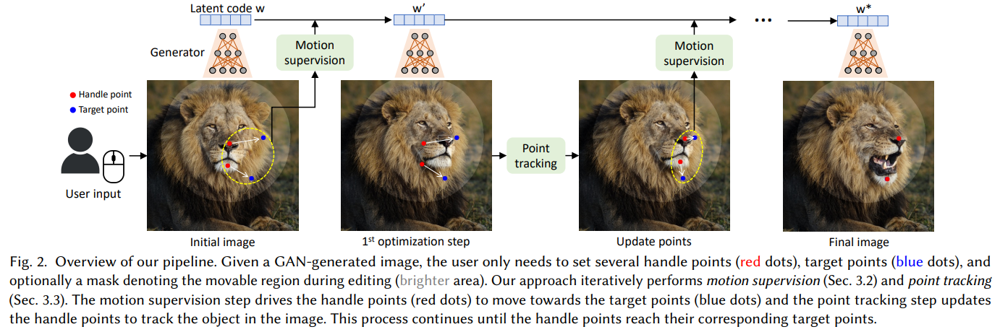
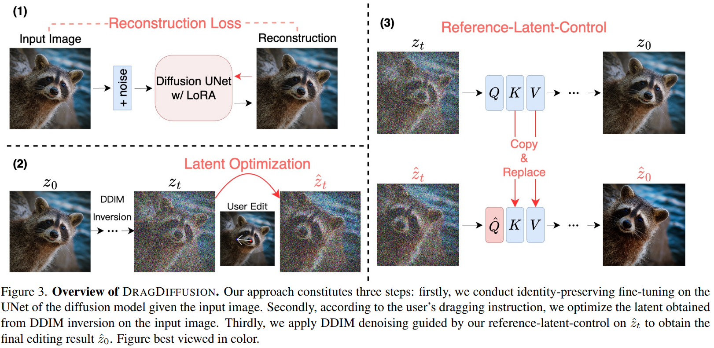

# Awesome Drag Editing Resources 
 A collection of papers and resources for drag editing
## Table of contents
- [Seminal Papers](#seminal-papers)
- [Editing Result Improvement](#editing-result-improvement)
- [Performance Improvement](#performance-improvement)
- [Novel View Perspective](#novel-view-perspective)
- [Novel View Application](#novel-view-application)
- [Uncategory Papers](#uncategory-papers)
- [Datasets](#datasets)
- [Software & Tools](#software--tools)
- [Tutorials & Videos](#tutorials--videos)
## Seminal Papers
### Drag Your GAN: Interactive Point-based Manipulation on the Generative Image Manifold (DragGAN)
[SIGGRAPH 2023]\
2023-05-18\
**Authors:** Xingang Pan, Ayush Tewari, Thomas Leimkühler, Lingjie Liu, Abhimitra Meka, Christian Theobalt

Abstract

Synthesizing visual content that meets users' needs often requires flexible and precise controllability of the pose, shape, expression, and layout of the generated objects. Existing approaches gain controllability of generative adversarial networks (GANs) via manually annotated training data or a prior 3D model, which often lack flexibility, precision, and generality. In this work, we study a powerful yet much less explored way of controlling GANs, that is, to "drag" any points of the image to precisely reach target points in a user-interactive manner, as shown in Fig.1. To achieve this, we propose DragGAN, which consists of two main components including: 1) a feature-based motion supervision that drives the handle point to move towards the target position, and 2) a new point tracking approach that leverages the discriminative GAN features to keep localizing the position of the handle points. Through DragGAN, anyone can deform an image with precise control over where pixels go, thus manipulating the pose, shape, expression, and layout of diverse categories such as animals, cars, humans, landscapes, etc. As these manipulations are performed on the learned generative image manifold of a GAN, they tend to produce realistic outputs even for challenging scenarios such as hallucinating occluded content and deforming shapes that consistently follow the object's rigidity. Both qualitative and quantitative comparisons demonstrate the advantage of DragGAN over prior approaches in the tasks of image manipulation and point tracking. We also showcase the manipulation of real images through GAN inversion.

### DragDiffusion: Harnessing Diffusion Models for Interactive Point-based Image Editing
[CVPR 2024]\
2023-06-26\
**Authors:** Yujun Shi, Chuhui Xue, Jun Hao Liew, Jiachun Pan, Hanshu Yan, Wenqing Zhang

Abstract

Precise and controllable image editing is a challenging task that has attracted significant attention. Recently, DragGAN enables an interactive point-based image editing framework and achieves impressive editing results with pixel-level precision. However, since this method is based on generative adversarial networks (GAN), its generality is upper-bounded by the capacity of the pre-trained GAN models. In this work, we extend such an editing framework to diffusion models and propose DragDiffusion. By leveraging large-scale pretrained diffusion models, we greatly improve the applicability of interactive point-based editing in real world scenarios. While most existing diffusion-based image editing methods work on text embeddings, DragDiffusion optimizes the diffusion latent to achieve precise spatial control. Although diffusion models generate images in an iterative manner, we empirically show that optimizing diffusion latent at one single step suffices to generate coherent results, enabling DragDiffusion to complete high-quality editing efficiently. Extensive experiments across a wide range of challenging cases (e.g., multi-objects, diverse object categories, various styles, etc.) demonstrate the versatility and generality of DragDiffusion.

## Editing Result Improvement
The Blessing of Randomness: SDE Beats ODE in General Diffusion-based Image Editing
 
Dragondiffusion: Enabling drag-style manipulation on diffusion models
 
Localize, Understand, Collaborate: Semantic-Aware Dragging via Intention Reasoner
FreeDrag: Feature Dragging for Reliable Point-based Image Editing
StableDrag: Stable Dragging for Point-based Image Editing
Drag Your Noise: Interactive Point-based Editing via Diffusion Semantic Propagation
## Performance Improvement
LightningDrag: Lightning Fast and Accurate Drag-based Image Editing Emerging from Videos
FastDrag: Manipulate Anything in One Step
InstantDrag: Improving Interactivity in Drag-based Image Editing
EasyDrag: Efficient Point-based Manipulation on Diffusion Models
Diffeditor: Boosting accuracy and flexibility on diffusion-based image editing
## Novel View Perspective
RegionDrag: Fast Region-Based Image Editing with Diffusion Models
## Novel View Application
DragVideo: Interactive Drag-style Video Editing
Drag3D: DragGAN meets GET3D
Edit One for All: Interactive Batch Image Editing
Dragapart: Learning a part-level motion prior for articulated objects
## Uncategory Papers
GeoDiffuser: Geometry-Based Image Editing with Diffusion Models
Move Anything with Layered Scene Diffusion
## Datasets
DragBench
https://github.com/Yujun-Shi/DragDiffusion/releases/tag/v0.1.1
## Software & Tools
## Tutorials & Videos
