# Awesome Drag Editing Resources 
 A collection of papers and resources for drag editing
## Table of contents
- [Seminal Papers](#seminal-papers)
- [Editing Result Improvement](#editing-result-improvement)
- [Performance Improvement](#performance-improvement)
- [Novel View Perspective](#novel-view-perspective)
- [Novel View Application](#novel-view-application)
- [Video Drag Editing](#video-drag-editing)
- [3D Drag Editing](#3D-drag-editing)
- [Uncategory Papers](#uncategory-papers)
- [Datasets](#datasets)
- [Software & Tools](#software--tools)
- [Tutorials & Videos](#tutorials--videos)
## Seminal Papers
### Drag Your GAN: Interactive Point-based Manipulation on the Generative Image Manifold (DragGAN)
 
 

 
\
2023-05-18\
**Authors:** Xingang Pan, Ayush Tewari, Thomas Leimkühler, Lingjie Liu, Abhimitra Meka, Christian Theobalt

Abstract

Synthesizing visual content that meets users' needs often requires flexible and precise controllability of the pose, shape, expression, and layout of the generated objects. Existing approaches gain controllability of generative adversarial networks (GANs) via manually annotated training data or a prior 3D model, which often lack flexibility, precision, and generality. In this work, we study a powerful yet much less explored way of controlling GANs, that is, to "drag" any points of the image to precisely reach target points in a user-interactive manner, as shown in Fig.1. To achieve this, we propose DragGAN, which consists of two main components including: 1) a feature-based motion supervision that drives the handle point to move towards the target position, and 2) a new point tracking approach that leverages the discriminative GAN features to keep localizing the position of the handle points. Through DragGAN, anyone can deform an image with precise control over where pixels go, thus manipulating the pose, shape, expression, and layout of diverse categories such as animals, cars, humans, landscapes, etc. As these manipulations are performed on the learned generative image manifold of a GAN, they tend to produce realistic outputs even for challenging scenarios such as hallucinating occluded content and deforming shapes that consistently follow the object's rigidity. Both qualitative and quantitative comparisons demonstrate the advantage of DragGAN over prior approaches in the tasks of image manipulation and point tracking. We also showcase the manipulation of real images through GAN inversion.

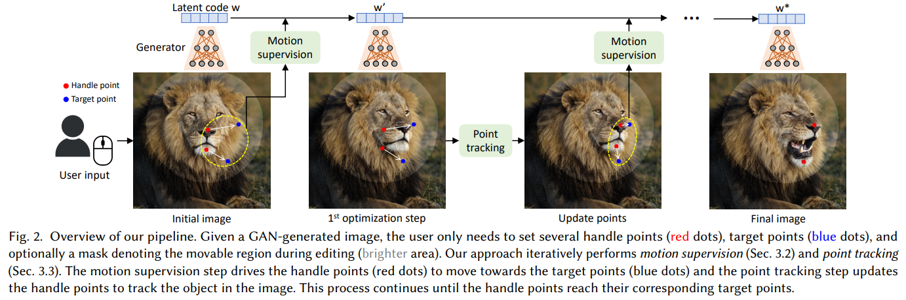

---

### DragDiffusion: Harnessing Diffusion Models for Interactive Point-based Image Editing
 
 

 
\
2023-06-26\
**Authors:** Yujun Shi, Chuhui Xue, Jun Hao Liew, Jiachun Pan, Hanshu Yan, Wenqing Zhang

Abstract

Precise and controllable image editing is a challenging task that has attracted significant attention. Recently, DragGAN enables an interactive point-based image editing framework and achieves impressive editing results with pixel-level precision. However, since this method is based on generative adversarial networks (GAN), its generality is upper-bounded by the capacity of the pre-trained GAN models. In this work, we extend such an editing framework to diffusion models and propose DragDiffusion. By leveraging large-scale pretrained diffusion models, we greatly improve the applicability of interactive point-based editing in real world scenarios. While most existing diffusion-based image editing methods work on text embeddings, DragDiffusion optimizes the diffusion latent to achieve precise spatial control. Although diffusion models generate images in an iterative manner, we empirically show that optimizing diffusion latent at one single step suffices to generate coherent results, enabling DragDiffusion to complete high-quality editing efficiently. Extensive experiments across a wide range of challenging cases (e.g., multi-objects, diverse object categories, various styles, etc.) demonstrate the versatility and generality of DragDiffusion.

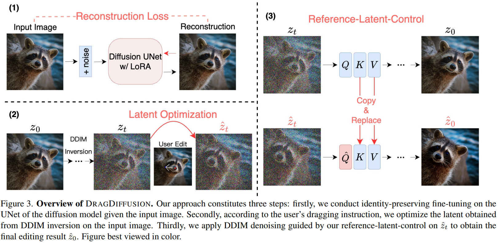

---

### DragonDiffusion: Enabling Drag-style Manipulation on Diffusion Models
 
 

 
\
2023-07-05\
**Authors:** Chong Mou, Xintao Wang, Jiechong Song, Ying Shan, Jian Zhang

Abstract

Despite the ability of existing large-scale text-to-image (T2I) models to generate high-quality images from detailed textual descriptions, they often lack the ability to precisely edit the generated or real images. In this paper, we propose a novel image editing method, DragonDiffusion, enabling Drag-style manipulation on Diffusion models. Specifically, we construct classifier guidance based on the strong correspondence of intermediate features in the diffusion model. It can transform the editing signals into gradients via feature correspondence loss to modify the intermediate representation of the diffusion model. Based on this guidance strategy, we also build a multi-scale guidance to consider both semantic and geometric alignment. Moreover, a cross-branch self-attention is added to maintain the consistency between the original image and the editing result. Our method, through an efficient design, achieves various editing modes for the generated or real images, such as object moving, object resizing, object appearance replacement, and content dragging. It is worth noting that all editing and content preservation signals come from the image itself, and the model does not require fine-tuning or additional modules.

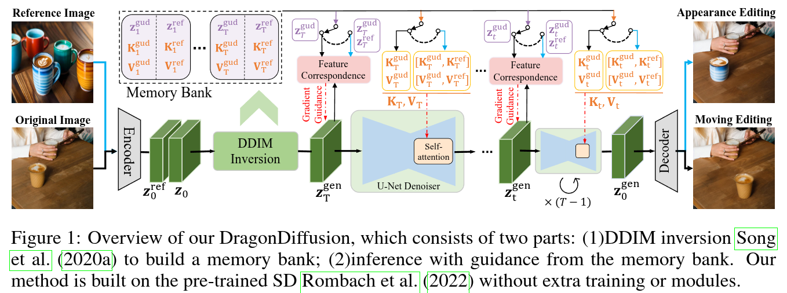

## Editing Result Improvement

### FreeDrag: Feature Dragging for Reliable Point-based Image Editing
 
 

 
\
2023-07-10\
**Authors:** Pengyang Ling, Lin Chen, Pan Zhang, Huaian Chen, Yi Jin, Jinjin Zheng

Abstract

To serve the intricate and varied demands of image editing, precise and flexible manipulation in image content is indispensable. Recently, Drag-based editing methods have gained impressive performance. However, these methods predominantly center on point dragging, resulting in two noteworthy drawbacks, namely "miss tracking", where difficulties arise in accurately tracking the predetermined handle points, and "ambiguous tracking", where tracked points are potentially positioned in wrong regions that closely resemble the handle points. To address the above issues, we propose FreeDrag, a feature dragging methodology designed to free the burden on point tracking. The FreeDrag incorporates two key designs, i.e., template feature via adaptive updating and line search with backtracking, the former improves the stability against drastic content change by elaborately controls feature updating scale after each dragging, while the latter alleviates the misguidance from similar points by actively restricting the search area in a line. These two technologies together contribute to a more stable semantic dragging with higher efficiency. Comprehensive experimental results substantiate that our approach significantly outperforms pre-existing methodologies, offering reliable point-based editing even in various complex scenarios.

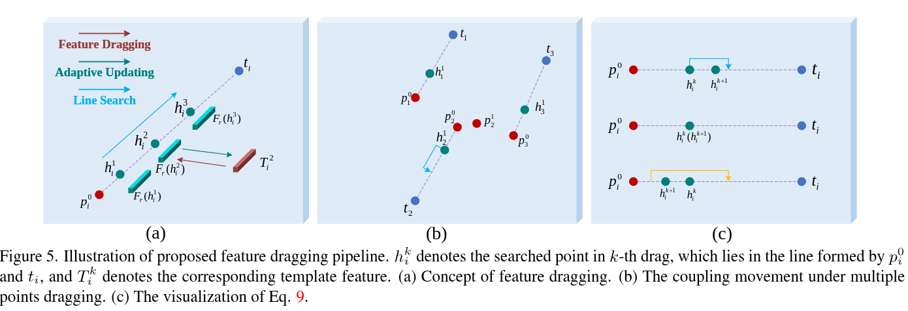

---
### The Blessing of Randomness: SDE Beats ODE in General Diffusion-Based Image Editing (SDE-Drag)
 
 

 
\
2023-11-02\
**Authors:** Shen Nie, Hanzhong Allan Guo, Cheng Lu, Yuhao Zhou, Chenyu Zheng, Chongxuan Li

Abstract

We present a unified probabilistic formulation for diffusion-based image editing, where a latent variable is edited in a task-specific manner and generally deviates from the corresponding marginal distribution induced by the original stochastic or ordinary differential equation (SDE or ODE). Instead, it defines a corresponding SDE or ODE for editing. In the formulation, we prove that the Kullback-Leibler divergence between the marginal distributions of the two SDEs gradually decreases while that for the ODEs remains as the time approaches zero, which shows the promise of SDE in image editing. Inspired by it, we provide the SDE counterparts for widely used ODE baselines in various tasks including inpainting and image-to-image translation, where SDE shows a consistent and substantial improvement. Moreover, we propose SDE-Drag -- a simple yet effective method built upon the SDE formulation for point-based content dragging. We build a challenging benchmark (termed DragBench) with open-set natural, art, and AI-generated images for evaluation. A user study on DragBench indicates that SDE-Drag significantly outperforms our ODE baseline, existing diffusion-based methods, and the renowned DragGAN. Our results demonstrate the superiority and versatility of SDE in image editing and push the boundary of diffusion-based editing methods.

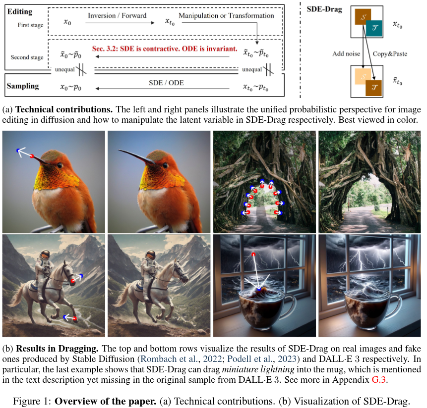

---

### RotationDrag: Point-based Image Editing with Rotated Diffusion Features
 

 
\
2024-01-12\
**Authors:** Minxing Luo, Wentao Cheng, Jian Yang

Abstract

A precise and user-friendly manipulation of image content while preserving image fidelity has always been crucial to the field of image editing. Thanks to the power of generative models, recent point-based image editing methods allow users to interactively change the image content with high generalizability by clicking several control points. But the above mentioned editing process is usually based on the assumption that features stay constant in the motion supervision step from initial to target points. In this work, we conduct a comprehensive investigation in the feature space of diffusion models, and find that features change acutely under in-plane rotation. Based on this, we propose a novel approach named RotationDrag, which significantly improves point-based image editing performance when users intend to in-plane rotate the image content. Our method tracks handle points more precisely by utilizing the feature map of the rotated images, thus ensuring precise optimization and high image fidelity. Furthermore, we build a in-plane rotation focused benchmark called RotateBench, the first benchmark to evaluate the performance of point-based image editing method under in-plane rotation scenario on both real images and generated images. A thorough user study demonstrates the superior capability in accomplishing in-plane rotation that users intend to achieve, comparing the DragDiffusion baseline and other existing diffusion-based methods.

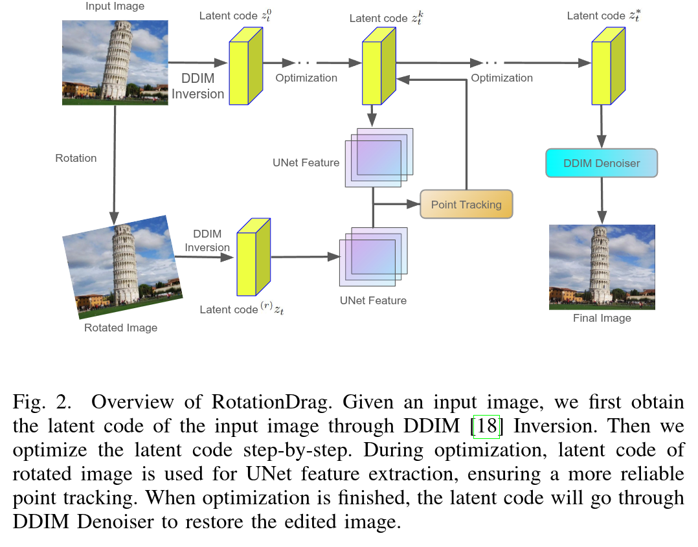

---

### StableDrag: Stable Dragging for Point-based Image Editing
 
 

 
\
2024-03-07\
**Authors:** Yutao Cui, Xiaotong Zhao, Guozhen Zhang, Shengming Cao, Kai Ma, Limin Wang

Abstract

Point-based image editing has attracted remarkable attention since the emergence of DragGAN. Recently, DragDiffusion further pushes forward the generative quality via adapting this dragging technique to diffusion models. Despite these great success, this dragging scheme exhibits two major drawbacks, namely inaccurate point tracking and incomplete motion supervision, which may result in unsatisfactory dragging outcomes. To tackle these issues, we build a stable and precise drag-based editing framework, coined as StableDrag, by designing a discirminative point tracking method and a confidence-based latent enhancement strategy for motion supervision. The former allows us to precisely locate the updated handle points, thereby boosting the stability of long-range manipulation, while the latter is responsible for guaranteeing the optimized latent as high-quality as possible across all the manipulation steps. Thanks to these unique designs, we instantiate two types of image editing models including StableDrag-GAN and StableDrag-Diff, which attains more stable dragging performance, through extensive qualitative experiments and quantitative assessment on DragBench.

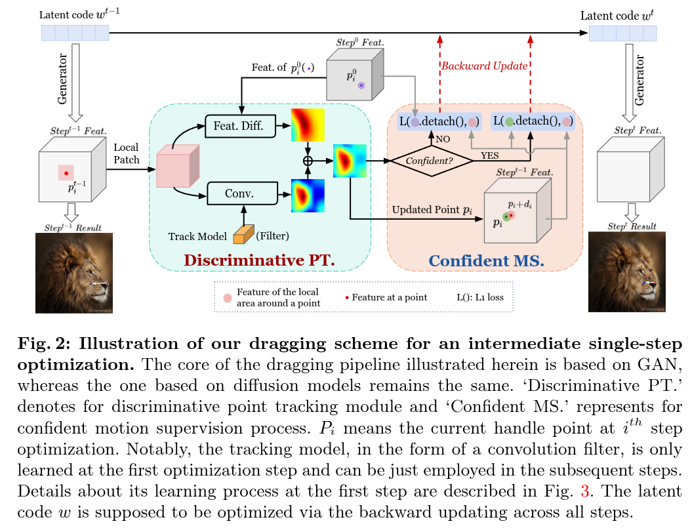

---

### Drag Your Noise: Interactive Point-based Editing via Diffusion Semantic Propagation
 
 

 
\
2024-04-01\
**Authors:** Haofeng Liu, Chenshu Xu, Yifei Yang, Lihua Zeng, Shengfeng He

Abstract

Point-based interactive editing serves as an essential tool to complement the controllability of existing generative models. A concurrent work, DragDiffusion, updates the diffusion latent map in response to user inputs, causing global latent map alterations. This results in imprecise preservation of the original content and unsuccessful editing due to gradient vanishing. In contrast, we present DragNoise, offering robust and accelerated editing without retracing the latent map. The core rationale of DragNoise lies in utilizing the predicted noise output of each U-Net as a semantic editor. This approach is grounded in two critical observations: firstly, the bottleneck features of U-Net inherently possess semantically rich features ideal for interactive editing; secondly, high-level semantics, established early in the denoising process, show minimal variation in subsequent stages. Leveraging these insights, DragNoise edits diffusion semantics in a single denoising step and efficiently propagates these changes, ensuring stability and efficiency in diffusion editing. Comparative experiments reveal that DragNoise achieves superior control and semantic retention, reducing the optimization time by over 50% compared to DragDiffusion.

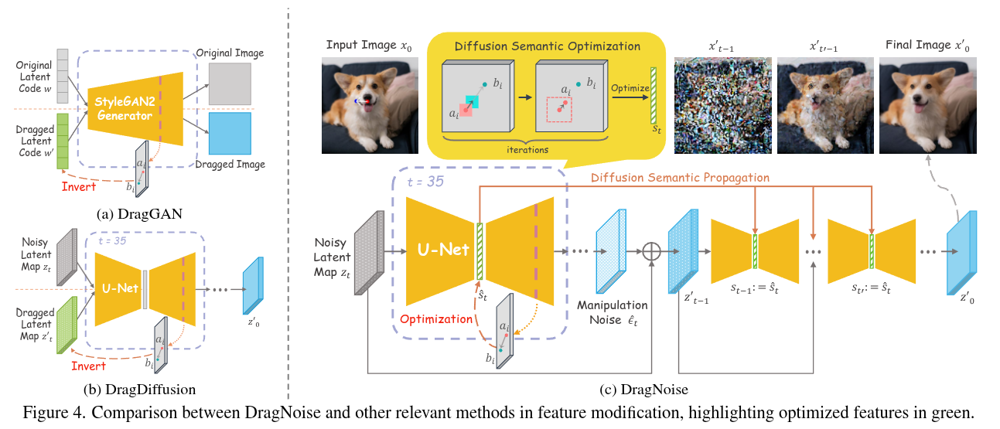

---

### GoodDrag: Towards Good Practices for Drag Editing with Diffusion Models
 

 
\
2024-04-10\
**Authors:** Zewei Zhang, Huan Liu, Jun Chen, Xiangyu Xu

Abstract

In this paper, we introduce GoodDrag, a novel approach to improve the stability and image quality of drag editing. Unlike existing methods that struggle with accumulated perturbations and often result in distortions, GoodDrag introduces an AlDD framework that alternates between drag and denoising operations within the diffusion process, effectively improving the fidelity of the result. We also propose an information-preserving motion supervision operation that maintains the original features of the starting point for precise manipulation and artifact reduction. In addition, we contribute to the benchmarking of drag editing by introducing a new dataset, Drag100, and developing dedicated quality assessment metrics, Dragging Accuracy Index and Gemini Score, utilizing Large Multimodal Models. Extensive experiments demonstrate that the proposed GoodDrag compares favorably against the state-of-the-art approaches both qualitatively and quantitatively.

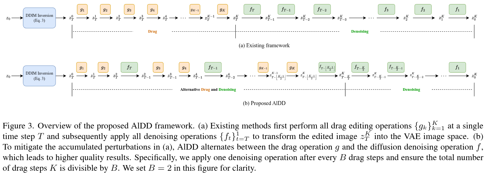

---

### Localize, Understand, Collaborate: Semantic-Aware Dragging via Intention Reasoner
 
 

 
\
2024-06-01\
**Authors:** Xing Cui, Peipei Li, Zekun Li, Xuannan Liu, Yueying Zou, Zhaofeng He

Abstract

Flexible and accurate drag-based editing is a challenging task that has recently garnered significant attention. Current methods typically model this problem as automatically learning "how to drag" through point dragging and often produce one deterministic estimation, which presents two key limitations: 1) Overlooking the inherently ill-posed nature of drag-based editing, where multiple results may correspond to a given input, as illustrated in Fig.1; 2) Ignoring the constraint of image quality, which may lead to unexpected distortion. To alleviate this, we propose LucidDrag, which shifts the focus from "how to drag" to "what-then-how" paradigm. LucidDrag comprises an intention reasoner and a collaborative guidance sampling mechanism. The former infers several optimal editing strategies, identifying what content and what semantic direction to be edited. Based on the former, the latter addresses "how to drag" by collaboratively integrating existing editing guidance with the newly proposed semantic guidance and quality guidance. Specifically, semantic guidance is derived by establishing a semantic editing direction based on reasoned intentions, while quality guidance is achieved through classifier guidance using an image fidelity discriminator. Both qualitative and quantitative comparisons demonstrate the superiority of LucidDrag over previous methods.

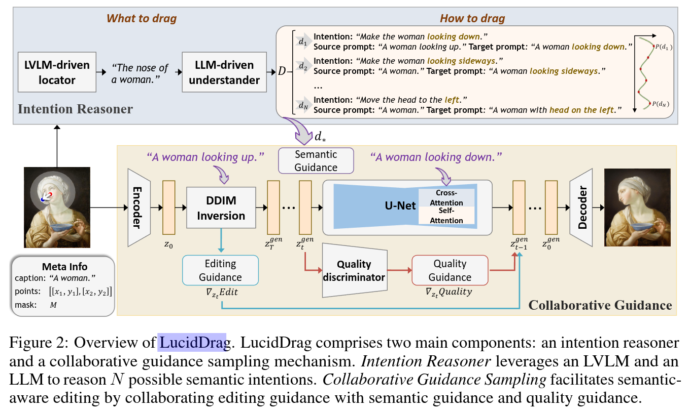

---

### DragText: Rethinking Text Embedding in Point-based Image Editing
 
 

 
\
2024-07-25\
**Authors:** Gayoon Choi, Taejin Jeong, Sujung Hong, Seong Jae Hwang

Abstract

Point-based image editing enables accurate and flexible control through content dragging. However, the role of text embedding during the editing process has not been thoroughly investigated. A significant aspect that remains unexplored is the interaction between text and image embeddings. During the progressive editing in a diffusion model, the text embedding remains constant. As the image embedding increasingly diverges from its initial state, the discrepancy between the image and text embeddings presents a significant challenge. In this study, we found that the text prompt significantly influences the dragging process, particularly in maintaining content integrity and achieving the desired manipulation. Upon these insights, we propose DragText, which optimizes text embedding in conjunction with the dragging process to pair with the modified image embedding. Simultaneously, we regularize the text optimization process to preserve the integrity of the original text prompt. Our approach can be seamlessly integrated with existing diffusion-based drag methods, enhancing performance with only a few lines of code.

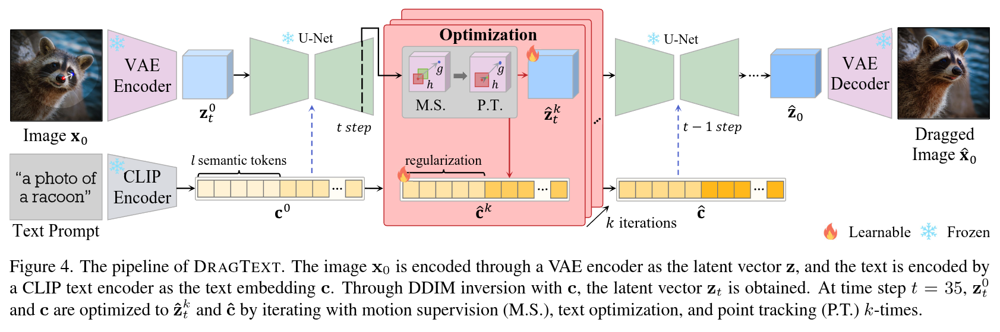

---

## Performance Improvement
### Diffeditor: Boosting accuracy and flexibility on diffusion-based image editing
 
 

 
\
2024-02-04\
**Authors:** Chong Mou, Xintao Wang, Jiechong Song, Ying Shan, Jian Zhang

Abstract

Large-scale Text-to-Image (T2I) diffusion models have revolutionized image generation over the last few years. Although owning diverse and high-quality generation capabilities, translating these abilities to fine-grained image editing remains challenging. In this paper, we propose DiffEditor to rectify two weaknesses in existing diffusion-based image editing: (1) in complex scenarios, editing results often lack editing accuracy and exhibit unexpected artifacts; (2) lack of flexibility to harmonize editing operations, e.g., imagine new content. In our solution, we introduce image prompts in fine-grained image editing, cooperating with the text prompt to better describe the editing content. To increase the flexibility while maintaining content consistency, we locally combine stochastic differential equation (SDE) into the ordinary differential equation (ODE) sampling. In addition, we incorporate regional score-based gradient guidance and a time travel strategy into the diffusion sampling, further improving the editing quality. Extensive experiments demonstrate that our method can efficiently achieve state-of-the-art performance on various fine-grained image editing tasks, including editing within a single image (e.g., object moving, resizing, and content dragging) and across images (e.g., appearance replacing and object pasting).

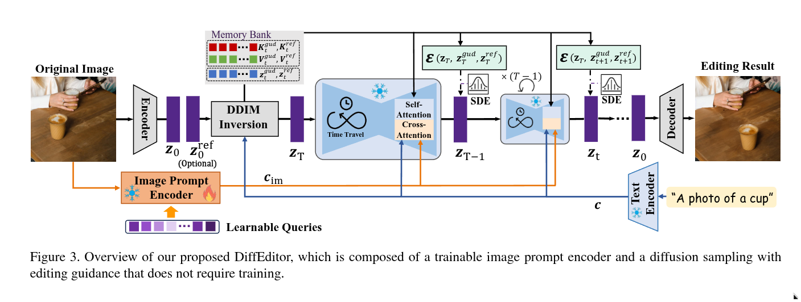

---

### EasyDrag: Efficient Point-based Manipulation on Diffusion Models
 

 
\
2024-03-20\
**Authors:** Hou, Xingzhong and Liu, Boxiao and Zhang, Yi and Liu, Jihao and Liu, Yu and You, Haihang

Abstract

Generative models are gaining increasing popularity, and the demand for precisely generating images is on the rise. However, generating an image that perfectly aligns with users’ expectations is extremely challenging. The shapes of objects, the poses of animals, the structures of landscapes, and more may not match the user’s desires, and this applies to real images as well. This is where point- based image editing becomes essential. An excellent im- age editing method needs to meet the following criteria: user-friendly interaction, high performance, and good gen- eralization capability. Due to the limitations of StyleGAN, DragGAN exhibits limited robustness across diverse sce- narios, while DragDiffusion lacks user-friendliness due to the necessity of LoRA fine-tuning and masks. In this paper, we introduce a novel interactive point-based image edit- ing framework, called EasyDrag, that leverages pretrained diffusion models to achieve high-quality editing outcomes and user-friendship. Extensive experimentation demon- strates that our approach surpasses DragDiffusion in terms of both image quality and editing precision for point-based image manipulation tasks.

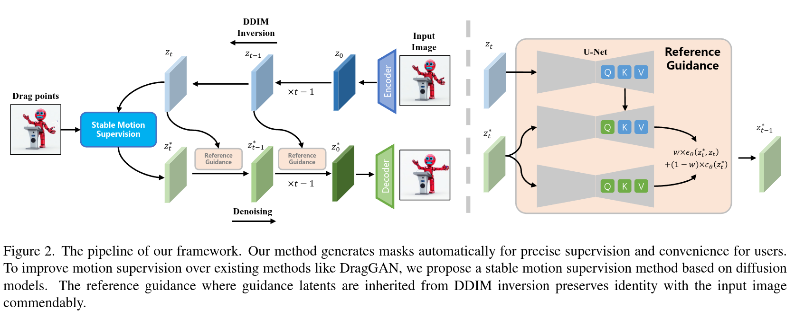

---

### LightningDrag: Lightning Fast and Accurate Drag-based Image Editing Emerging from Videos
 
 

 
\
2024-05-22\
**Authors:** Yujun Shi, Jun Hao Liew, Hanshu Yan, Vincent Y. F. Tan, Jiashi Feng

Abstract

Accuracy and speed are critical in image editing tasks. Pan et al. introduced a drag-based image editing framework that achieves pixel-level control using Generative Adversarial Networks (GANs). A flurry of subsequent studies enhanced this framework's generality by leveraging large-scale diffusion models. However, these methods often suffer from inordinately long processing times (exceeding 1 minute per edit) and low success rates. Addressing these issues head on, we present LightningDrag, a rapid approach enabling high quality drag-based image editing in ~1 second. Unlike most previous methods, we redefine drag-based editing as a conditional generation task, eliminating the need for time-consuming latent optimization or gradient-based guidance during inference. In addition, the design of our pipeline allows us to train our model on large-scale paired video frames, which contain rich motion information such as object translations, changing poses and orientations, zooming in and out, etc. By learning from videos, our approach can significantly outperform previous methods in terms of accuracy and consistency. Despite being trained solely on videos, our model generalizes well to perform local shape deformations not presented in the training data (e.g., lengthening of hair, twisting rainbows, etc.). Extensive qualitative and quantitative evaluations on benchmark datasets corroborate the superiority of our approach. 

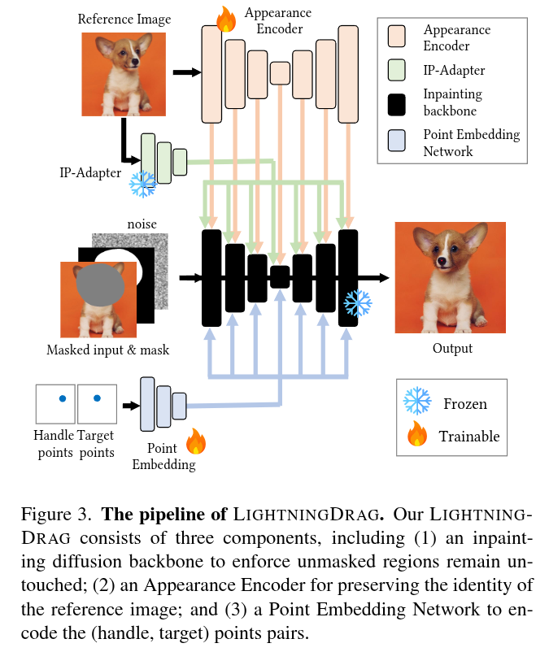

---

### FastDrag: Manipulate Anything in One Step
 
 

 
\
2024-05-24\
**Authors:** Xuanjia Zhao, Jian Guan, Congyi Fan, Dongli Xu, Youtian Lin, Haiwei Pan, Pengming Feng

Abstract

Drag-based image editing using generative models provides precise control over image contents, enabling users to manipulate anything in an image with a few clicks. However, prevailing methods typically adopt n-step iterations for latent semantic optimization to achieve drag-based image editing, which is time-consuming and limits practical applications. In this paper, we introduce a novel one-step drag-based image editing method, i.e., FastDrag, to accelerate the editing process. Central to our approach is a latent warpage function (LWF), which simulates the behavior of a stretched material to adjust the location of individual pixels within the latent space. This innovation achieves one-step latent semantic optimization and hence significantly promotes editing speeds. Meanwhile, null regions emerging after applying LWF are addressed by our proposed bilateral nearest neighbor interpolation (BNNI) strategy. This strategy interpolates these regions using similar features from neighboring areas, thus enhancing semantic integrity. Additionally, a consistency-preserving strategy is introduced to maintain the consistency between the edited and original images by adopting semantic information from the original image, saved as key and value pairs in self-attention module during diffusion inversion, to guide the diffusion sampling. Our FastDrag is validated on the DragBench dataset, demonstrating substantial improvements in processing time over existing methods, while achieving enhanced editing performance. 

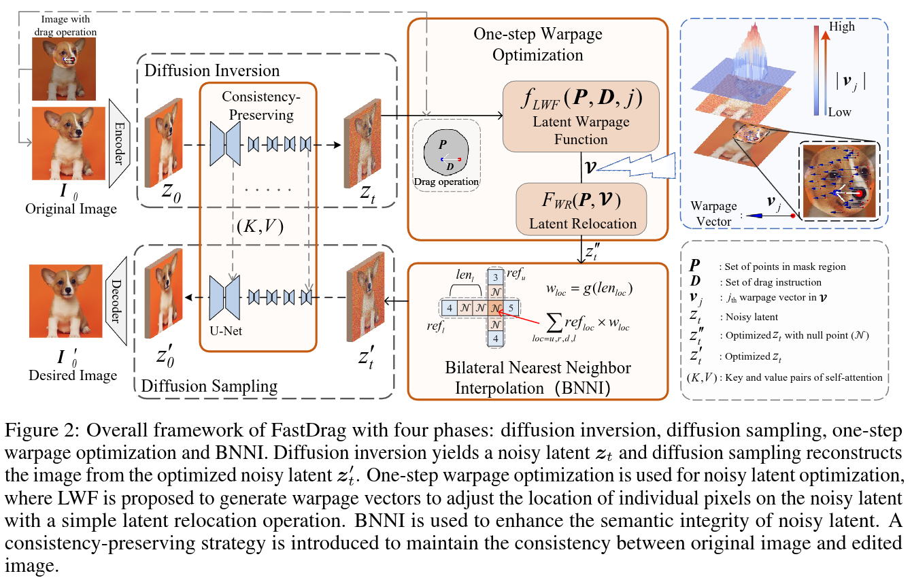

---

### InstantDrag: Improving Interactivity in Drag-based Image Editing
 
 

 
\
2024-09-13\
**Authors:** Joonghyuk Shin, Daehyeon Choi, Jaesik Park

Abstract

Drag-based image editing has recently gained popularity for its interactivity and precision. However, despite the ability of text-to-image models to generate samples within a second, drag editing still lags behind due to the challenge of accurately reflecting user interaction while maintaining image content. Some existing approaches rely on computationally intensive per-image optimization or intricate guidance-based methods, requiring additional inputs such as masks for movable regions and text prompts, thereby compromising the interactivity of the editing process. We introduce InstantDrag, an optimization-free pipeline that enhances interactivity and speed, requiring only an image and a drag instruction as input. InstantDrag consists of two carefully designed networks: a drag-conditioned optical flow generator (FlowGen) and an optical flow-conditioned diffusion model (FlowDiffusion). InstantDrag learns motion dynamics for drag-based image editing in real-world video datasets by decomposing the task into motion generation and motion-conditioned image generation. We demonstrate InstantDrag's capability to perform fast, photo-realistic edits without masks or text prompts through experiments on facial video datasets and general scenes. These results highlight the efficiency of our approach in handling drag-based image editing, making it a promising solution for interactive, real-time applications.

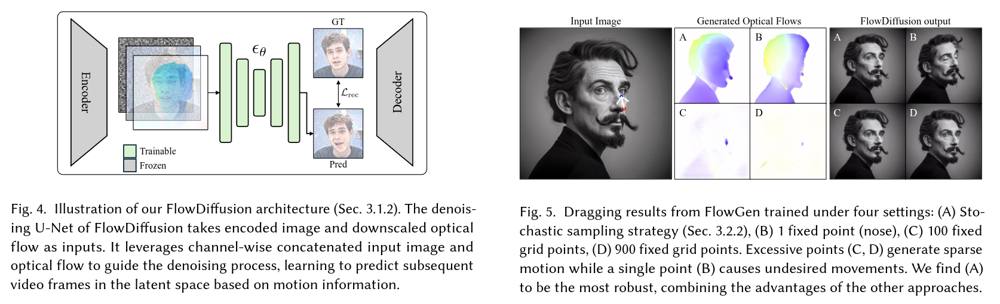

## Novel View Perspective

### Readout Guidance: Learning Control from Diffusion Features
 
 

 
\
2023-12-04\
**Authors:** Grace Luo, Trevor Darrell, Oliver Wang, Dan B Goldman, Aleksander Holynski

Abstract

We present Readout Guidance, a method for controlling text-to-image diffusion models with learned signals. Readout Guidance uses readout heads, lightweight networks trained to extract signals from the features of a pre-trained, frozen diffusion model at every timestep. These readouts can encode single-image properties, such as pose, depth, and edges; or higher-order properties that relate multiple images, such as correspondence and appearance similarity. Furthermore, by comparing the readout estimates to a user-defined target, and back-propagating the gradient through the readout head, these estimates can be used to guide the sampling process. Compared to prior methods for conditional generation, Readout Guidance requires significantly fewer added parameters and training samples, and offers a convenient and simple recipe for reproducing different forms of conditional control under a single framework, with a single architecture and sampling procedure. We showcase these benefits in the applications of drag-based manipulation, identity-consistent generation, and spatially aligned control.

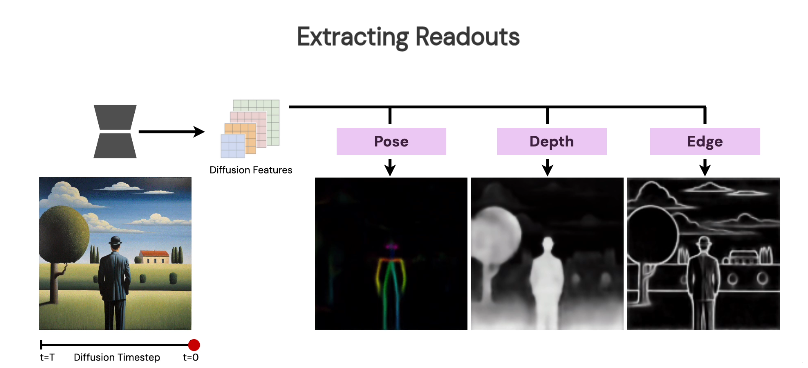

---

### RegionDrag: Fast Region-Based Image Editing with Diffusion Models
 
 

 
\
2024-07-25\
**Authors:** Jingyi Lu, Xinghui Li, Kai Han

Abstract

Point-drag-based image editing methods, like DragDiffusion, have attracted significant attention. However, point-drag-based approaches suffer from computational overhead and misinterpretation of user intentions due to the sparsity of point-based editing instructions. In this paper, we propose a region-based copy-and-paste dragging method, RegionDrag, to overcome these limitations. RegionDrag allows users to express their editing instructions in the form of handle and target regions, enabling more precise control and alleviating ambiguity. In addition, region-based operations complete editing in one iteration and are much faster than point-drag-based methods. We also incorporate the attention-swapping technique for enhanced stability during editing. To validate our approach, we extend existing point-drag-based datasets with region-based dragging instructions. Experimental results demonstrate that RegionDrag outperforms existing point-drag-based approaches in terms of speed, accuracy, and alignment with user intentions. Remarkably, RegionDrag completes the edit on an image with a resolution of 512x512 in less than 2 seconds, which is more than 100x faster than DragDiffusion, while achieving better performance. 

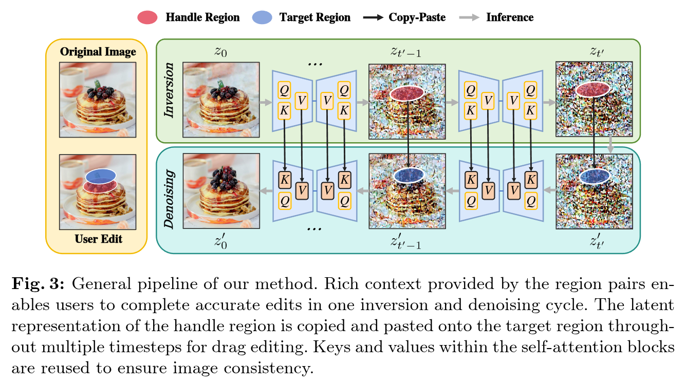

## Novel View Application

### Edit One for All: Interactive Batch Image Editing
 
 

 
\
2024-01-18\
**Authors:** Thao Nguyen, Utkarsh Ojha, Yuheng Li, Haotian Liu, Yong Jae Lee

Abstract

In recent years, image editing has advanced remarkably. With increased human control, it is now possible to edit an image in a plethora of ways; from specifying in text what we want to change, to straight up dragging the contents of the image in an interactive point-based manner. However, most of the focus has remained on editing single images at a time. Whether and how we can simultaneously edit large batches of images has remained understudied. With the goal of minimizing human supervision in the editing process, this paper presents a novel method for interactive batch image editing using StyleGAN as the medium. Given an edit specified by users in an example image (e.g., make the face frontal), our method can automatically transfer that edit to other test images, so that regardless of their initial state (pose), they all arrive at the same final state (e.g., all facing front). Extensive experiments demonstrate that edits performed using our method have similar visual quality to existing single-image-editing methods, while having more visual consistency and saving significant time and human effort.

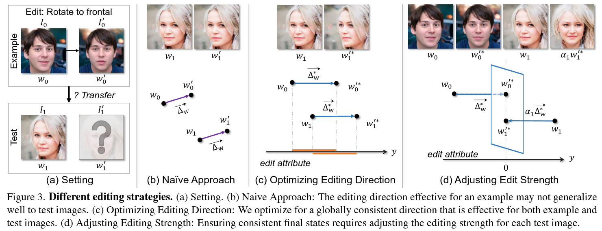

---

### Dragapart: Learning a part-level motion prior for articulated objects
 
 

 
\
2024-03-22\
**Authors:** Ruining Li, Chuanxia Zheng, Christian Rupprecht, Andrea Vedaldi

Abstract

We introduce DragAPart, a method that, given an image and a set of drags as input, generates a new image of the same object that responds to the action of the drags. Differently from prior works that focused on repositioning objects, DragAPart predicts part-level interactions, such as opening and closing a drawer. We study this problem as a proxy for learning a generalist motion model, not restricted to a specific kinematic structure or object category. We start from a pre-trained image generator and fine-tune it on a new synthetic dataset, Drag-a-Move, which we introduce. Combined with a new encoding for the drags and dataset randomization, the model generalizes well to real images and different categories. Compared to prior motion-controlled generators, we demonstrate much better part-level motion understanding.

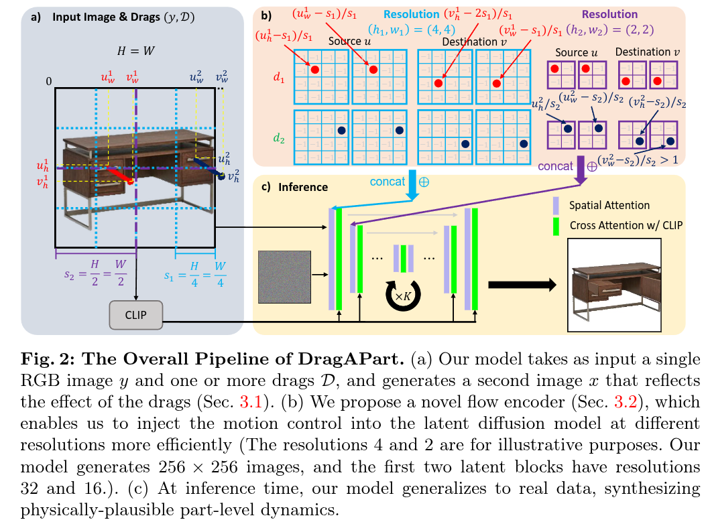

## Video Drag Editing
### DragVideo: Interactive Drag-style Video Editing
 
 

 
\
2023-12-03\
**Authors:** Yufan Deng, Ruida Wang, Yuhao Zhang, Yu-Wing Tai, Chi-Keung Tang

Abstract

Video generation models have shown their superior ability to generate photo-realistic video. However, how to accurately control (or edit) the video remains a formidable challenge. The main issues are: 1) how to perform direct and accurate user control in editing; 2) how to execute editings like changing shape, expression, and layout without unsightly distortion and artifacts to the edited content; and 3) how to maintain spatio-temporal consistency of video after editing. To address the above issues, we propose DragVideo, a general drag-style video editing framework. Inspired by DragGAN, DragVideo addresses issues 1) and 2) by proposing the drag-style video latent optimization method which gives desired control by updating noisy video latent according to drag instructions through video-level drag objective function. We amend issue 3) by integrating the video diffusion model with sample-specific LoRA and Mutual Self-Attention in DragVideo to ensure the edited result is spatio-temporally consistent. We also present a series of testing examples for drag-style video editing and conduct extensive experiments across a wide array of challenging editing tasks, such as motion, skeleton editing, etc, underscoring DragVideo can edit video in an intuitive, faithful to the user's intention manner, with nearly unnoticeable distortion and artifacts, while maintaining spatio-temporal consistency. While traditional prompt-based video editing fails to do the former two and directly applying image drag editing fails in the last, DragVideo's versatility and generality are emphasized.

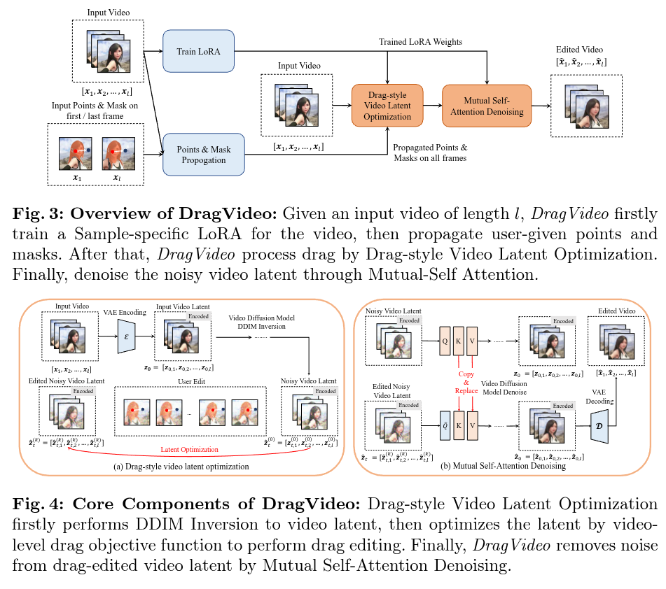

---

### Drag-A-Video: Non-rigid Video Editing with Point-based Interaction
 

 
\
2023-12-05\
**Authors:** Yao Teng, Enze Xie, Yue Wu, Haoyu Han, Zhenguo Li, Xihui Liu

Abstract

Video editing is a challenging task that requires manipulating videos on both the spatial and temporal dimensions. Existing methods for video editing mainly focus on changing the appearance or style of the objects in the video, while keeping their structures unchanged. However, there is no existing method that allows users to interactively ``drag'' any points of instances on the first frame to precisely reach the target points with other frames consistently deformed. In this paper, we propose a new diffusion-based method for interactive point-based video manipulation, called Drag-A-Video. Our method allows users to click pairs of handle points and target points as well as masks on the first frame of an input video. Then, our method transforms the inputs into point sets and propagates these sets across frames. To precisely modify the contents of the video, we employ a new video-level motion supervision to update the features of the video and introduce the latent offsets to achieve this update at multiple denoising timesteps. We propose a temporal-consistent point tracking module to coordinate the movement of the points in the handle point sets. We demonstrate the effectiveness and flexibility of our method on various videos. 

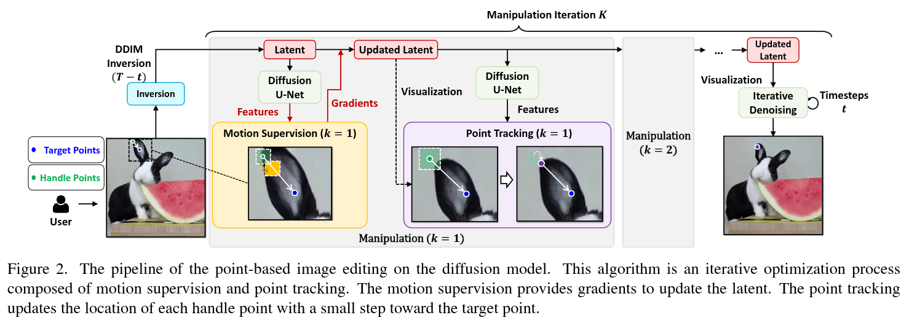

---

## 3D Drag Editing
### Drag3D: DragGAN meets GET3D

\
2023-05-23 \
[https://github.com/ashawkey/Drag3D](https://github.com/ashawkey/Drag3D)

Abstract

DragGAN meets GET3D for interactive mesh generation and editing.

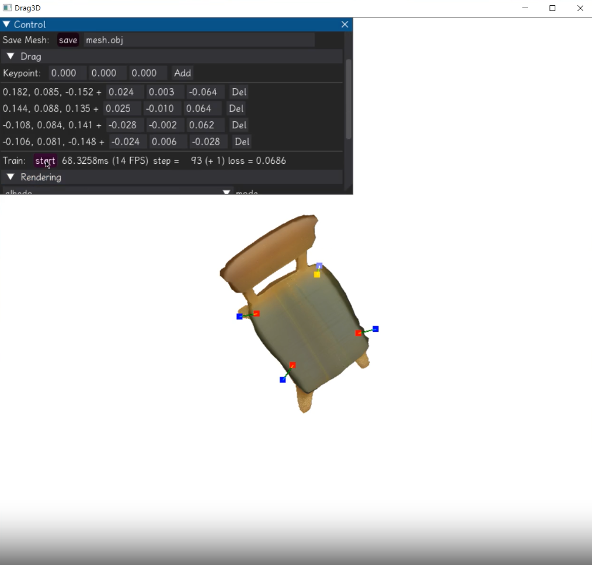

---

### DragGaussian: Enabling Drag-style Manipulation on 3D Gaussian Representation
 
 
\
2025-05-09\
**Authors:** Sitian Shen, Jing Xu, Yuheng Yuan, Xingyi Yang, Qiuhong Shen, Xinchao Wang

Abstract

User-friendly 3D object editing is a challenging task that has attracted significant attention recently. The limitations of direct 3D object editing without 2D prior knowledge have prompted increased attention towards utilizing 2D generative models for 3D editing. While existing methods like Instruct NeRF-to-NeRF offer a solution, they often lack user-friendliness, particularly due to semantic guided editing. In the realm of 3D representation, 3D Gaussian Splatting emerges as a promising approach for its efficiency and natural explicit property, facilitating precise editing tasks. Building upon these insights, we propose DragGaussian, a 3D object drag-editing framework based on 3D Gaussian Splatting, leveraging diffusion models for interactive image editing with open-vocabulary input. This framework enables users to perform drag-based editing on pre-trained 3D Gaussian object models, producing modified 2D images through multi-view consistent editing. Our contributions include the introduction of a new task, the development of DragGaussian for interactive point-based 3D editing, and comprehensive validation of its effectiveness through qualitative and quantitative experiments.

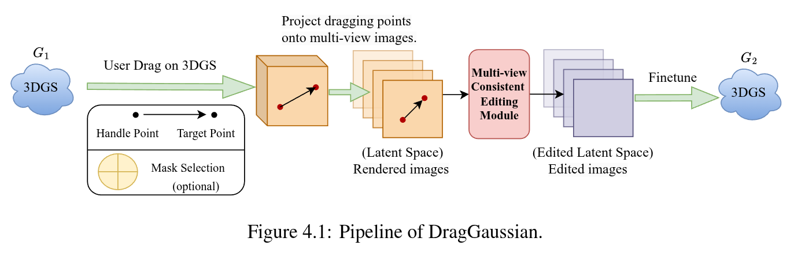

---

### MvDrag3D: Drag-based Creative 3D Editing via Multi-view Generation-Reconstruction Priors
 

 
\
2024-10-21\
**Authors:** Honghua Chen, Yushi Lan, Yongwei Chen, Yifan Zhou, Xingang Pan

Abstract

Drag-based editing has become popular in 2D content creation, driven by the capabilities of image generative models. However, extending this technique to 3D remains a challenge. Existing 3D drag-based editing methods, whether employing explicit spatial transformations or relying on implicit latent optimization within limited-capacity 3D generative models, fall short in handling significant topology changes or generating new textures across diverse object categories. To overcome these limitations, we introduce MVDrag3D, a novel framework for more flexible and creative drag-based 3D editing that leverages multi-view generation and reconstruction priors. At the core of our approach is the usage of a multi-view diffusion model as a strong generative prior to perform consistent drag editing over multiple rendered views, which is followed by a reconstruction model that reconstructs 3D Gaussians of the edited object. While the initial 3D Gaussians may suffer from misalignment between different views, we address this via view-specific deformation networks that adjust the position of Gaussians to be well aligned. In addition, we propose a multi-view score function that distills generative priors from multiple views to further enhance the view consistency and visual quality. Extensive experiments demonstrate that MVDrag3D provides a precise, generative, and flexible solution for 3D drag-based editing, supporting more versatile editing effects across various object categories and 3D representations.

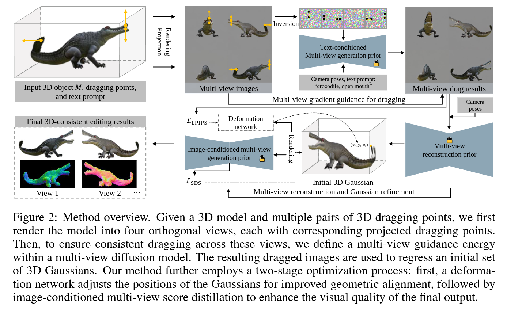

---

### DragScene: Interactive 3D Scene Editing with Single-view Drag Instructions
 
 
\
2024-12-18\
**Authors:** Chenghao Gu, Zhenzhe Li, Zhengqi Zhang, Yunpeng Bai, Shuzhao Xie, Zhi Wang

Abstract

3D editing has shown remarkable capability in editing scenes based on various instructions. However, existing methods struggle with achieving intuitive, localized editing, such as selectively making flowers blossom. Drag-style editing has shown exceptional capability to edit images with direct manipulation instead of ambiguous text commands. Nevertheless, extending drag-based editing to 3D scenes presents substantial challenges due to multi-view inconsistency. To this end, we introduce DragScene, a framework that integrates drag-style editing with diverse 3D representations. First, latent optimization is performed on a reference view to generate 2D edits based on user instructions. Subsequently, coarse 3D clues are reconstructed from the reference view using a point-based representation to capture the geometric details of the edits. The latent representation of the edited view is then mapped to these 3D clues, guiding the latent optimization of other views. This process ensures that edits are propagated seamlessly across multiple views, maintaining multi-view consistency. Finally, the target 3D scene is reconstructed from the edited multi-view images. Extensive experiments demonstrate that DragScene facilitates precise and flexible drag-style editing of 3D scenes, supporting broad applicability across diverse 3D representations.

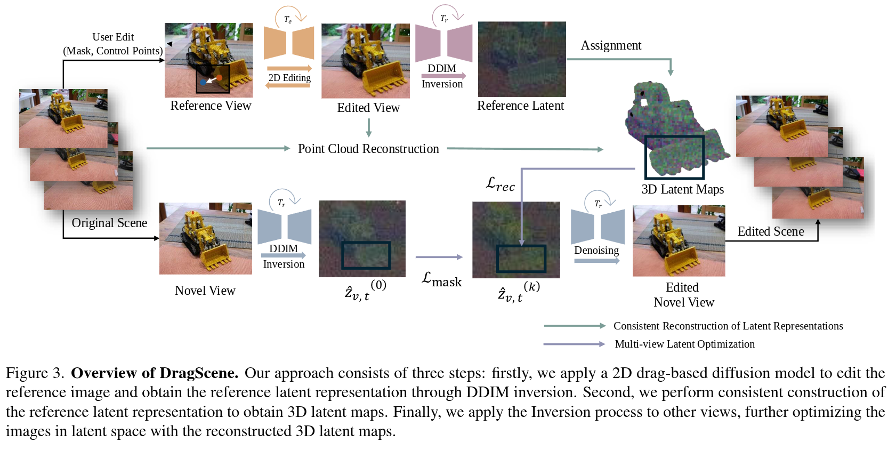

---

### 3DGS-Drag: Dragging Gaussians for Intuitive Point-Based 3D Editing
 
) 

 
\
2025-01-23\
**Authors:** Jiahua Dong, Yu-Xiong Wang

Abstract

The transformative potential of 3D content creation has been progressively unlocked through advancements in generative models. Recently, intuitive drag editing with geometric changes has attracted significant attention in 2D editing yet remains challenging for 3D scenes. In this paper, we introduce 3DGS-Drag, a point-based 3D editing framework that provides efficient, intuitive drag manipulation of real 3D scenes. Our approach bridges the gap between deformation-based and 2D-editing-based 3D editing methods, addressing their limitations to geometry-related content editing. We leverage two key innovations: deformation guidance utilizing 3D Gaussian Splatting for consistent geometric modifications and diffusion guidance for content correction and visual quality enhancement. A progressive editing strategy further supports aggressive 3D drag edits. Our method enables a wide range of edits, including motion change, shape adjustment, inpainting, and content extension. Experimental results demonstrate the effectiveness of 3DGS-Drag in various scenes, achieving state-of-the-art performance in geometry-related 3D content editing. Notably, the editing is efficient, taking 10 to 20 minutes on a single RTX 4090 GPU.

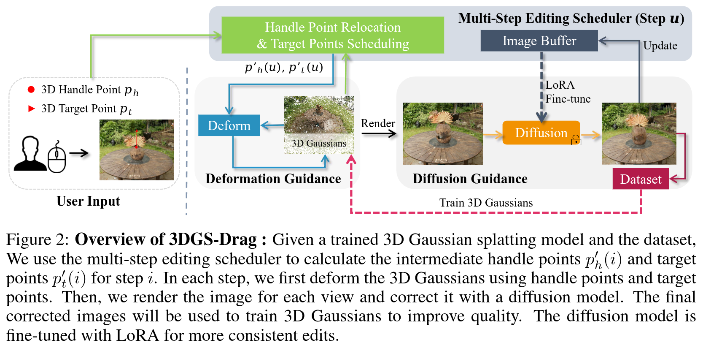

---

## Uncategory Papers

### GeoDiffuser: Geometry-Based Image Editing with Diffusion Models
 

 
\
2024-04-22\
**Authors:** Rahul Sajnani, Jeroen Vanbaar, Jie Min, Kapil Katyal, Srinath Sridhar

Abstract

The success of image generative models has enabled us to build methods that can edit images based on text or other user input. However, these methods are bespoke, imprecise, require additional information, or are limited to only 2D image edits. We present GeoDiffuser, a zero-shot optimization-based method that unifies common 2D and 3D image-based object editing capabilities into a single method. Our key insight is to view image editing operations as geometric transformations. We show that these transformations can be directly incorporated into the attention layers in diffusion models to implicitly perform editing operations. Our training-free optimization method uses an objective function that seeks to preserve object style but generate plausible images, for instance with accurate lighting and shadows. It also inpaints disoccluded parts of the image where the object was originally located. Given a natural image and user input, we segment the foreground object using SAM and estimate a corresponding transform which is used by our optimization approach for editing. GeoDiffuser can perform common 2D and 3D edits like object translation, 3D rotation, and removal. We present quantitative results, including a perceptual study, that shows how our approach is better than existing methods.

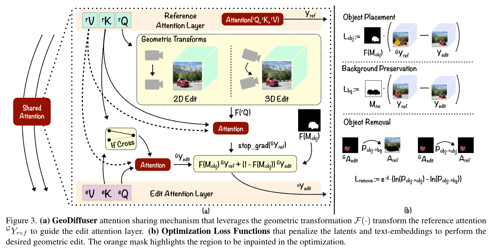

### Move Anything with Layered Scene Diffusion
 

 
\
2024-04-10\
**Authors:** Jiawei Ren, Mengmeng Xu, Jui-Chieh Wu, Ziwei Liu, Tao Xiang, Antoine Toisoul

Abstract

Diffusion models generate images with an unprecedented level of quality, but how can we freely rearrange image layouts? Recent works generate controllable scenes via learning spatially disentangled latent codes, but these methods do not apply to diffusion models due to their fixed forward process. In this work, we propose SceneDiffusion to optimize a layered scene representation during the diffusion sampling process. Our key insight is that spatial disentanglement can be obtained by jointly denoising scene renderings at different spatial layouts. Our generated scenes support a wide range of spatial editing operations, including moving, resizing, cloning, and layer-wise appearance editing operations, including object restyling and replacing. Moreover, a scene can be generated conditioned on a reference image, thus enabling object moving for in-the-wild images. Notably, this approach is training-free, compatible with general text-to-image diffusion models, and responsive in less than a second.

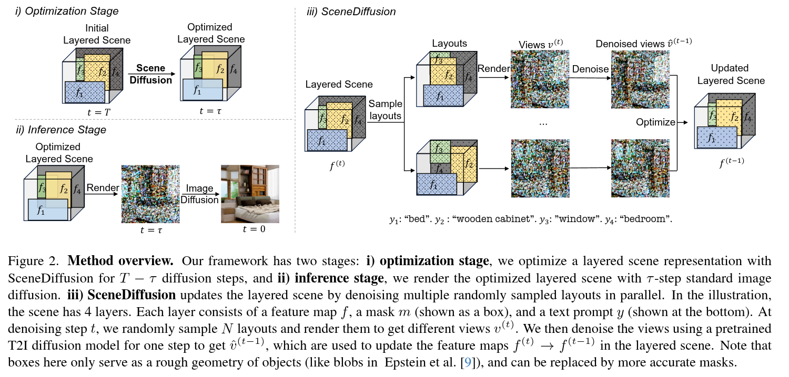

---

## Datasets
### DragBench
https://github.com/Yujun-Shi/DragDiffusion/releases/tag/v0.1.1
### FreeDragBench
https://drive.google.com/file/d/1p2muR6aW6fqEGW8yTcHl86DCuUkwgtNY/view?usp=sharing
### Drag100
https://drive.google.com/file/d/1qzUizzrSRd4bBaT-0bCYZr-MDpiKXjhW/view?usp=sharing
## Software & Tools
comming soon...
## Tutorials & Videos
comming soon...
## Related Repositories
* [Awesome-DragGAN](https://github.com/OpenGVLab/Awesome-DragGAN)
* [Awesome Diffusion Categorized](https://github.com/wangkai930418/awesome-diffusion-categorized?tab=readme-ov-file#drag-edit)

## Contact Info
[contact@frakw.com](mailto:contact@frakw.com)