# Awesome Drag Editing Resources 
 A collection of papers and resources for drag editing
## Table of contents
- [Seminal Papers](#seminal-papers)
- [Editing Result Improvement](#editing-result-improvement)
- [Performance Improvement](#performance-improvement)
- [Novel View Perspective](#novel-view-perspective)
- [Novel View Application](#novel-view-application)
- [Video Drag Editing](#video-drag-editing)
- [Video Generation](#video-generation)
- [3D Drag Editing For 2D Image](#3D-drag-editing-for-2d-image)
- [3D Drag Editing For 3D Object](#3D-drag-editing-for-3d-object)
- [4D Drag Editing](#4D-drag-editing)
- [Uncategory Papers](#uncategory-papers)
- [Datasets](#datasets)
- [Software & Tools](#software--tools)
- [Tutorials & Videos](#tutorials--videos)
## Seminal Papers
### EditGAN: High-Precision Semantic Image Editing
 
 

 
\
2021-11-04\
**Authors:** Huan Ling, Karsten Kreis, Daiqing Li, Seung Wook Kim, Antonio Torralba, Sanja Fidler

Abstract

Generative adversarial networks (GANs) have recently found applications in image editing. However, most GAN based image editing methods often require large scale datasets with semantic segmentation annotations for training, only provide high level control, or merely interpolate between different images. Here, we propose EditGAN, a novel method for high quality, high precision semantic image editing, allowing users to edit images by modifying their highly detailed part segmentation masks, e.g., drawing a new mask for the headlight of a car. EditGAN builds on a GAN framework that jointly models images and their semantic segmentations, requiring only a handful of labeled examples, making it a scalable tool for editing. Specifically, we embed an image into the GAN latent space and perform conditional latent code optimization according to the segmentation edit, which effectively also modifies the image. To amortize optimization, we find editing vectors in latent space that realize the edits. The framework allows us to learn an arbitrary number of editing vectors, which can then be directly applied on other images at interactive rates. We experimentally show that EditGAN can manipulate images with an unprecedented level of detail and freedom, while preserving full image this http URL can also easily combine multiple edits and perform plausible edits beyond EditGAN training data. We demonstrate EditGAN on a wide variety of image types and quantitatively outperform several previous editing methods on standard editing benchmark tasks.

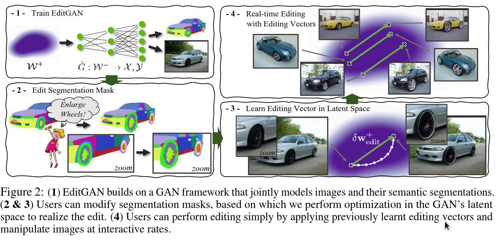

---

### User-Controllable Latent Transformer for StyleGAN Image Layout Editing (UserControllableLT)
 
 

 
\
2022-08-26\
**Authors:** Yuki Endo

Abstract

Latent space exploration is a technique that discovers interpretable latent directions and manipulates latent codes to edit various attributes in images generated by generative adversarial networks (GANs). However, in previous work, spatial control is limited to simple transformations (e.g., translation and rotation), and it is laborious to identify appropriate latent directions and adjust their parameters. In this paper, we tackle the problem of editing the StyleGAN image layout by annotating the image directly. To do so, we propose an interactive framework for manipulating latent codes in accordance with the user inputs. In our framework, the user annotates a StyleGAN image with locations they want to move or not and specifies a movement direction by mouse dragging. From these user inputs and initial latent codes, our latent transformer based on a transformer encoder-decoder architecture estimates the output latent codes, which are fed to the StyleGAN generator to obtain a result image. To train our latent transformer, we utilize synthetic data and pseudo-user inputs generated by off-the-shelf StyleGAN and optical flow models, without manual supervision. Quantitative and qualitative evaluations demonstrate the effectiveness of our method over existing methods.

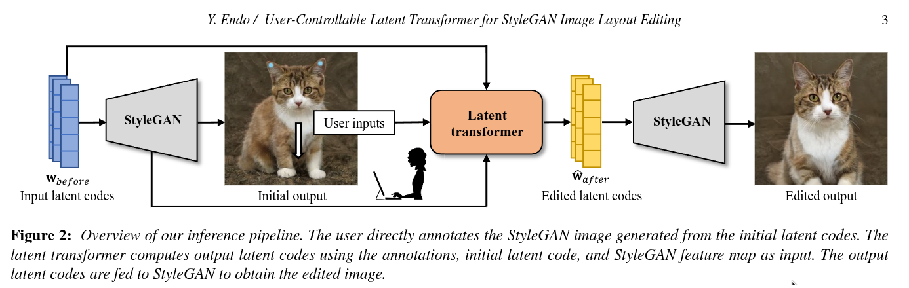

---

### Drag Your GAN: Interactive Point-based Manipulation on the Generative Image Manifold (DragGAN)
 
 

 
\
2023-05-18\
**Authors:** Xingang Pan, Ayush Tewari, Thomas Leimkühler, Lingjie Liu, Abhimitra Meka, Christian Theobalt

Abstract

Synthesizing visual content that meets users' needs often requires flexible and precise controllability of the pose, shape, expression, and layout of the generated objects. Existing approaches gain controllability of generative adversarial networks (GANs) via manually annotated training data or a prior 3D model, which often lack flexibility, precision, and generality. In this work, we study a powerful yet much less explored way of controlling GANs, that is, to "drag" any points of the image to precisely reach target points in a user-interactive manner, as shown in Fig.1. To achieve this, we propose DragGAN, which consists of two main components including: 1) a feature-based motion supervision that drives the handle point to move towards the target position, and 2) a new point tracking approach that leverages the discriminative GAN features to keep localizing the position of the handle points. Through DragGAN, anyone can deform an image with precise control over where pixels go, thus manipulating the pose, shape, expression, and layout of diverse categories such as animals, cars, humans, landscapes, etc. As these manipulations are performed on the learned generative image manifold of a GAN, they tend to produce realistic outputs even for challenging scenarios such as hallucinating occluded content and deforming shapes that consistently follow the object's rigidity. Both qualitative and quantitative comparisons demonstrate the advantage of DragGAN over prior approaches in the tasks of image manipulation and point tracking. We also showcase the manipulation of real images through GAN inversion.

---

### DragDiffusion: Harnessing Diffusion Models for Interactive Point-based Image Editing
 
 

 
\
2023-06-26\
**Authors:** Yujun Shi, Chuhui Xue, Jun Hao Liew, Jiachun Pan, Hanshu Yan, Wenqing Zhang

Abstract

Precise and controllable image editing is a challenging task that has attracted significant attention. Recently, DragGAN enables an interactive point-based image editing framework and achieves impressive editing results with pixel-level precision. However, since this method is based on generative adversarial networks (GAN), its generality is upper-bounded by the capacity of the pre-trained GAN models. In this work, we extend such an editing framework to diffusion models and propose DragDiffusion. By leveraging large-scale pretrained diffusion models, we greatly improve the applicability of interactive point-based editing in real world scenarios. While most existing diffusion-based image editing methods work on text embeddings, DragDiffusion optimizes the diffusion latent to achieve precise spatial control. Although diffusion models generate images in an iterative manner, we empirically show that optimizing diffusion latent at one single step suffices to generate coherent results, enabling DragDiffusion to complete high-quality editing efficiently. Extensive experiments across a wide range of challenging cases (e.g., multi-objects, diverse object categories, various styles, etc.) demonstrate the versatility and generality of DragDiffusion.

---

### DragonDiffusion: Enabling Drag-style Manipulation on Diffusion Models
 
 

 
\
2023-07-05\
**Authors:** Chong Mou, Xintao Wang, Jiechong Song, Ying Shan, Jian Zhang

Abstract

Despite the ability of existing large-scale text-to-image (T2I) models to generate high-quality images from detailed textual descriptions, they often lack the ability to precisely edit the generated or real images. In this paper, we propose a novel image editing method, DragonDiffusion, enabling Drag-style manipulation on Diffusion models. Specifically, we construct classifier guidance based on the strong correspondence of intermediate features in the diffusion model. It can transform the editing signals into gradients via feature correspondence loss to modify the intermediate representation of the diffusion model. Based on this guidance strategy, we also build a multi-scale guidance to consider both semantic and geometric alignment. Moreover, a cross-branch self-attention is added to maintain the consistency between the original image and the editing result. Our method, through an efficient design, achieves various editing modes for the generated or real images, such as object moving, object resizing, object appearance replacement, and content dragging. It is worth noting that all editing and content preservation signals come from the image itself, and the model does not require fine-tuning or additional modules.

## Editing Result Improvement

### FreeDrag: Feature Dragging for Reliable Point-based Image Editing
 
 

 
\
2023-07-10\
**Authors:** Pengyang Ling, Lin Chen, Pan Zhang, Huaian Chen, Yi Jin, Jinjin Zheng

Abstract

To serve the intricate and varied demands of image editing, precise and flexible manipulation in image content is indispensable. Recently, Drag-based editing methods have gained impressive performance. However, these methods predominantly center on point dragging, resulting in two noteworthy drawbacks, namely "miss tracking", where difficulties arise in accurately tracking the predetermined handle points, and "ambiguous tracking", where tracked points are potentially positioned in wrong regions that closely resemble the handle points. To address the above issues, we propose FreeDrag, a feature dragging methodology designed to free the burden on point tracking. The FreeDrag incorporates two key designs, i.e., template feature via adaptive updating and line search with backtracking, the former improves the stability against drastic content change by elaborately controls feature updating scale after each dragging, while the latter alleviates the misguidance from similar points by actively restricting the search area in a line. These two technologies together contribute to a more stable semantic dragging with higher efficiency. Comprehensive experimental results substantiate that our approach significantly outperforms pre-existing methodologies, offering reliable point-based editing even in various complex scenarios.

---
### The Blessing of Randomness: SDE Beats ODE in General Diffusion-Based Image Editing (SDE-Drag)
 
 

 
\
2023-11-02\
**Authors:** Shen Nie, Hanzhong Allan Guo, Cheng Lu, Yuhao Zhou, Chenyu Zheng, Chongxuan Li

Abstract

We present a unified probabilistic formulation for diffusion-based image editing, where a latent variable is edited in a task-specific manner and generally deviates from the corresponding marginal distribution induced by the original stochastic or ordinary differential equation (SDE or ODE). Instead, it defines a corresponding SDE or ODE for editing. In the formulation, we prove that the Kullback-Leibler divergence between the marginal distributions of the two SDEs gradually decreases while that for the ODEs remains as the time approaches zero, which shows the promise of SDE in image editing. Inspired by it, we provide the SDE counterparts for widely used ODE baselines in various tasks including inpainting and image-to-image translation, where SDE shows a consistent and substantial improvement. Moreover, we propose SDE-Drag -- a simple yet effective method built upon the SDE formulation for point-based content dragging. We build a challenging benchmark (termed DragBench) with open-set natural, art, and AI-generated images for evaluation. A user study on DragBench indicates that SDE-Drag significantly outperforms our ODE baseline, existing diffusion-based methods, and the renowned DragGAN. Our results demonstrate the superiority and versatility of SDE in image editing and push the boundary of diffusion-based editing methods.

---

### RotationDrag: Point-based Image Editing with Rotated Diffusion Features
 

 
\
2024-01-12\
**Authors:** Minxing Luo, Wentao Cheng, Jian Yang

Abstract

A precise and user-friendly manipulation of image content while preserving image fidelity has always been crucial to the field of image editing. Thanks to the power of generative models, recent point-based image editing methods allow users to interactively change the image content with high generalizability by clicking several control points. But the above mentioned editing process is usually based on the assumption that features stay constant in the motion supervision step from initial to target points. In this work, we conduct a comprehensive investigation in the feature space of diffusion models, and find that features change acutely under in-plane rotation. Based on this, we propose a novel approach named RotationDrag, which significantly improves point-based image editing performance when users intend to in-plane rotate the image content. Our method tracks handle points more precisely by utilizing the feature map of the rotated images, thus ensuring precise optimization and high image fidelity. Furthermore, we build a in-plane rotation focused benchmark called RotateBench, the first benchmark to evaluate the performance of point-based image editing method under in-plane rotation scenario on both real images and generated images. A thorough user study demonstrates the superior capability in accomplishing in-plane rotation that users intend to achieve, comparing the DragDiffusion baseline and other existing diffusion-based methods.

---

### StableDrag: Stable Dragging for Point-based Image Editing
 
 

 
\
2024-03-07\
**Authors:** Yutao Cui, Xiaotong Zhao, Guozhen Zhang, Shengming Cao, Kai Ma, Limin Wang

Abstract

Point-based image editing has attracted remarkable attention since the emergence of DragGAN. Recently, DragDiffusion further pushes forward the generative quality via adapting this dragging technique to diffusion models. Despite these great success, this dragging scheme exhibits two major drawbacks, namely inaccurate point tracking and incomplete motion supervision, which may result in unsatisfactory dragging outcomes. To tackle these issues, we build a stable and precise drag-based editing framework, coined as StableDrag, by designing a discirminative point tracking method and a confidence-based latent enhancement strategy for motion supervision. The former allows us to precisely locate the updated handle points, thereby boosting the stability of long-range manipulation, while the latter is responsible for guaranteeing the optimized latent as high-quality as possible across all the manipulation steps. Thanks to these unique designs, we instantiate two types of image editing models including StableDrag-GAN and StableDrag-Diff, which attains more stable dragging performance, through extensive qualitative experiments and quantitative assessment on DragBench.

---

### Drag Your Noise: Interactive Point-based Editing via Diffusion Semantic Propagation (DragNoise)
 
 

 
\
2024-04-01\
**Authors:** Haofeng Liu, Chenshu Xu, Yifei Yang, Lihua Zeng, Shengfeng He

Abstract

Point-based interactive editing serves as an essential tool to complement the controllability of existing generative models. A concurrent work, DragDiffusion, updates the diffusion latent map in response to user inputs, causing global latent map alterations. This results in imprecise preservation of the original content and unsuccessful editing due to gradient vanishing. In contrast, we present DragNoise, offering robust and accelerated editing without retracing the latent map. The core rationale of DragNoise lies in utilizing the predicted noise output of each U-Net as a semantic editor. This approach is grounded in two critical observations: firstly, the bottleneck features of U-Net inherently possess semantically rich features ideal for interactive editing; secondly, high-level semantics, established early in the denoising process, show minimal variation in subsequent stages. Leveraging these insights, DragNoise edits diffusion semantics in a single denoising step and efficiently propagates these changes, ensuring stability and efficiency in diffusion editing. Comparative experiments reveal that DragNoise achieves superior control and semantic retention, reducing the optimization time by over 50% compared to DragDiffusion.

---

### GoodDrag: Towards Good Practices for Drag Editing with Diffusion Models
 
 

 
\
2024-04-10\
**Authors:** Zewei Zhang, Huan Liu, Jun Chen, Xiangyu Xu

Abstract

In this paper, we introduce GoodDrag, a novel approach to improve the stability and image quality of drag editing. Unlike existing methods that struggle with accumulated perturbations and often result in distortions, GoodDrag introduces an AlDD framework that alternates between drag and denoising operations within the diffusion process, effectively improving the fidelity of the result. We also propose an information-preserving motion supervision operation that maintains the original features of the starting point for precise manipulation and artifact reduction. In addition, we contribute to the benchmarking of drag editing by introducing a new dataset, Drag100, and developing dedicated quality assessment metrics, Dragging Accuracy Index and Gemini Score, utilizing Large Multimodal Models. Extensive experiments demonstrate that the proposed GoodDrag compares favorably against the state-of-the-art approaches both qualitatively and quantitatively.

---

### Localize, Understand, Collaborate: Semantic-Aware Dragging via Intention Reasoner (LucidDrag)
 
 

 
\
2024-06-01\
**Authors:** Xing Cui, Peipei Li, Zekun Li, Xuannan Liu, Yueying Zou, Zhaofeng He

Abstract

Flexible and accurate drag-based editing is a challenging task that has recently garnered significant attention. Current methods typically model this problem as automatically learning "how to drag" through point dragging and often produce one deterministic estimation, which presents two key limitations: 1) Overlooking the inherently ill-posed nature of drag-based editing, where multiple results may correspond to a given input, as illustrated in Fig.1; 2) Ignoring the constraint of image quality, which may lead to unexpected distortion. To alleviate this, we propose LucidDrag, which shifts the focus from "how to drag" to "what-then-how" paradigm. LucidDrag comprises an intention reasoner and a collaborative guidance sampling mechanism. The former infers several optimal editing strategies, identifying what content and what semantic direction to be edited. Based on the former, the latter addresses "how to drag" by collaboratively integrating existing editing guidance with the newly proposed semantic guidance and quality guidance. Specifically, semantic guidance is derived by establishing a semantic editing direction based on reasoned intentions, while quality guidance is achieved through classifier guidance using an image fidelity discriminator. Both qualitative and quantitative comparisons demonstrate the superiority of LucidDrag over previous methods.

---

### DiffUHaul: A Training-Free Method for Object Dragging in Images
 
 

 
\
2024-06-03\
**Authors:** Omri Avrahami, Rinon Gal, Gal Chechik, Ohad Fried, Dani Lischinski, Arash Vahdat, Weili Nie

Abstract

Text-to-image diffusion models have proven effective for solving many image editing tasks. However, the seemingly straightforward task of seamlessly relocating objects within a scene remains surprisingly challenging. Existing methods addressing this problem often struggle to function reliably in real-world scenarios due to lacking spatial reasoning. In this work, we propose a training-free method, dubbed DiffUHaul, that harnesses the spatial understanding of a localized text-to-image model, for the object dragging task. Blindly manipulating layout inputs of the localized model tends to cause low editing performance due to the intrinsic entanglement of object representation in the model. To this end, we first apply attention masking in each denoising step to make the generation more disentangled across different objects and adopt the self-attention sharing mechanism to preserve the high-level object appearance. Furthermore, we propose a new diffusion anchoring technique: in the early denoising steps, we interpolate the attention features between source and target images to smoothly fuse new layouts with the original appearance; in the later denoising steps, we pass the localized features from the source images to the interpolated images to retain fine-grained object details. To adapt DiffUHaul to real-image editing, we apply a DDPM self-attention bucketing that can better reconstruct real images with the localized model. Finally, we introduce an automated evaluation pipeline for this task and showcase the efficacy of our method. Our results are reinforced through a user preference study.

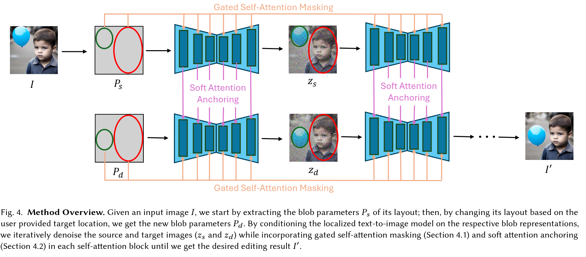

---

### DragText: Rethinking Text Embedding in Point-based Image Editing
 
 

 
\
2024-07-25\
**Authors:** Gayoon Choi, Taejin Jeong, Sujung Hong, Seong Jae Hwang

Abstract

Point-based image editing enables accurate and flexible control through content dragging. However, the role of text embedding during the editing process has not been thoroughly investigated. A significant aspect that remains unexplored is the interaction between text and image embeddings. During the progressive editing in a diffusion model, the text embedding remains constant. As the image embedding increasingly diverges from its initial state, the discrepancy between the image and text embeddings presents a significant challenge. In this study, we found that the text prompt significantly influences the dragging process, particularly in maintaining content integrity and achieving the desired manipulation. Upon these insights, we propose DragText, which optimizes text embedding in conjunction with the dragging process to pair with the modified image embedding. Simultaneously, we regularize the text optimization process to preserve the integrity of the original text prompt. Our approach can be seamlessly integrated with existing diffusion-based drag methods, enhancing performance with only a few lines of code.

---

### CLIPDrag: Combining Text-based and Drag-based Instructions for Image Editing
 
 

 
\
2024-10-04\
**Authors:** Ziqi Jiang, Zhen Wang, Long Chen

Abstract

Precise and flexible image editing remains a fundamental challenge in computer vision. Based on the modified areas, most editing methods can be divided into two main types: global editing and local editing. In this paper, we choose the two most common editing approaches (ie text-based editing and drag-based editing) and analyze their drawbacks. Specifically, text-based methods often fail to describe the desired modifications precisely, while drag-based methods suffer from ambiguity. To address these issues, we proposed \textbf{CLIPDrag}, a novel image editing method that is the first to combine text and drag signals for precise and ambiguity-free manipulations on diffusion models. To fully leverage these two signals, we treat text signals as global guidance and drag points as local information. Then we introduce a novel global-local motion supervision method to integrate text signals into existing drag-based methods by adapting a pre-trained language-vision model like CLIP. Furthermore, we also address the problem of slow convergence in CLIPDrag by presenting a fast point-tracking method that enforces drag points moving toward correct directions. Extensive experiments demonstrate that CLIPDrag outperforms existing single drag-based methods or text-based methods.

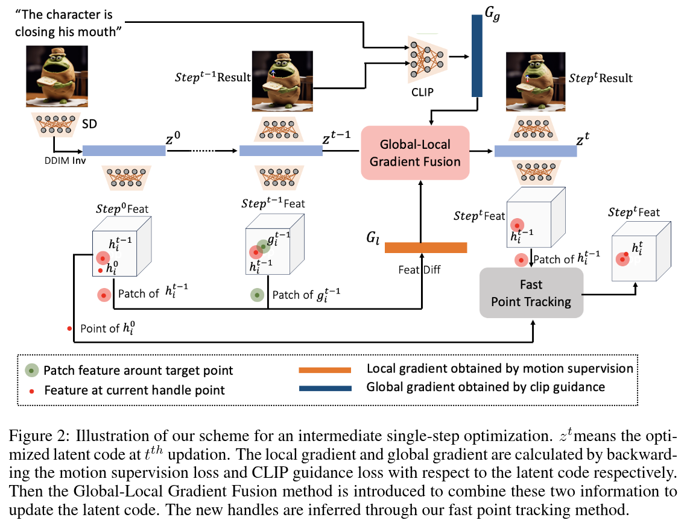

---

### AdaptiveDrag: Semantic-Driven Dragging on Diffusion-Based Image Editing
 

 
\
2024-10-16\
**Authors:** DuoSheng Chen, Binghui Chen, Yifeng Geng, Liefeng Bo

Abstract

Recently, several point-based image editing methods (e.g., DragDiffusion, FreeDrag, DragNoise) have emerged, yielding precise and high-quality results based on user instructions. However, these methods often make insufficient use of semantic information, leading to less desirable results. In this paper, we proposed a novel mask-free point-based image editing method, AdaptiveDrag, which provides a more flexible editing approach and generates images that better align with user intent. Specifically, we design an auto mask generation module using super-pixel division for user-friendliness. Next, we leverage a pre-trained diffusion model to optimize the latent, enabling the dragging of features from handle points to target points. To ensure a comprehensive connection between the input image and the drag process, we have developed a semantic-driven optimization. We design adaptive steps that are supervised by the positions of the points and the semantic regions derived from super-pixel segmentation. This refined optimization process also leads to more realistic and accurate drag results. Furthermore, to address the limitations in the generative consistency of the diffusion model, we introduce an innovative corresponding loss during the sampling process. Building on these effective designs, our method delivers superior generation results using only the single input image and the handle-target point pairs. Extensive experiments have been conducted and demonstrate that the proposed method outperforms others in handling various drag instructions (e.g., resize, movement, extension) across different domains (e.g., animals, human face, land space, clothing).

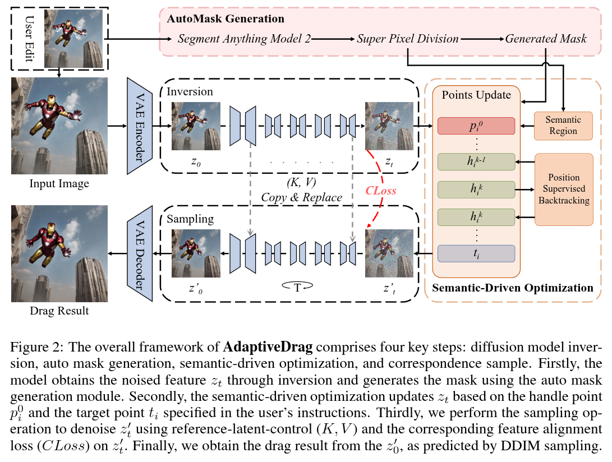

---

### GDrag:Towards General-Purpose Interactive Editing with Anti-ambiguity Point Diffusion
 
 

 
\
2025-01-23\
**Authors:** Xiaojian Lin, Hanhui Li, Yuhao Cheng, Yiqiang Yan, Xiaodan Liang

Abstract

Recent interactive point-based image manipulation methods have gained considerable attention for being user-friendly. However, these methods still face two types of ambiguity issues that can lead to unsatisfactory outcomes, namely, intention ambiguity which misinterprets the purposes of users, and content ambiguity where target image areas are distorted by distracting elements. To address these issues and achieve general-purpose manipulations, we propose a novel task-aware, training-free framework called GDrag. Specifically, GDrag defines a taxonomy of atomic manipulations, which can be parameterized and combined unitedly to represent complex manipulations, thereby reducing intention ambiguity. Furthermore, GDrag introduces two strategies to mitigate content ambiguity, including an anti-ambiguity dense trajectory calculation method (ADT) and a self-adaptive motion supervision method (SMS). Given an atomic manipulation, ADT converts the sparse user-defined handle points into a dense point set by selecting their semantic and geometric neighbors, and calculates the trajectory of the point set. Unlike previous motion supervision methods relying on a single global scale for low-rank adaption, SMS jointly optimizes point-wise adaption scales and latent feature biases. These two methods allow us to model fine-grained target contexts and generate precise trajectories. As a result, GDrag consistently produces precise and appealing results in different editing tasks. Extensive experiments on the challenging DragBench dataset demonstrate that GDrag outperforms state-of-the-art methods significantly. 

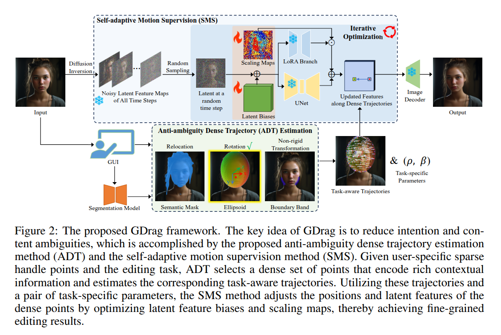

---

### Training-free Dense-Aligned Diffusion Guidance for Modular Conditional Image Synthesis (DADG)
 
 

 
\
2025-04-02\
**Authors:** Zixuan Wang, Duo Peng, Feng Chen, Yuwei Yang, Yinjie Lei

Abstract

Conditional image synthesis is a crucial task with broad applications, such as artistic creation and virtual reality. However, current generative methods are often task-oriented with a narrow scope, handling a restricted condition with constrained applicability. In this paper, we propose a novel approach that treats conditional image synthesis as the modular combination of diverse fundamental condition units. Specifically, we divide conditions into three primary units: text, layout, and drag. To enable effective control over these conditions, we design a dedicated alignment module for each. For the text condition, we introduce a Dense Concept Alignment (DCA) module, which achieves dense visual-text alignment by drawing on diverse textual concepts. For the layout condition, we propose a Dense Geometry Alignment (DGA) module to enforce comprehensive geometric constraints that preserve the spatial configuration. For the drag condition, we introduce a Dense Motion Alignment (DMA) module to apply multi-level motion regularization, ensuring that each pixel follows its desired trajectory without visual artifacts. By flexibly inserting and combining these alignment modules, our framework enhances the model's adaptability to diverse conditional generation tasks and greatly expands its application range. Extensive experiments demonstrate the superior performance of our framework across a variety of conditions, including textual description, segmentation mask (bounding box), drag manipulation, and their combinations.

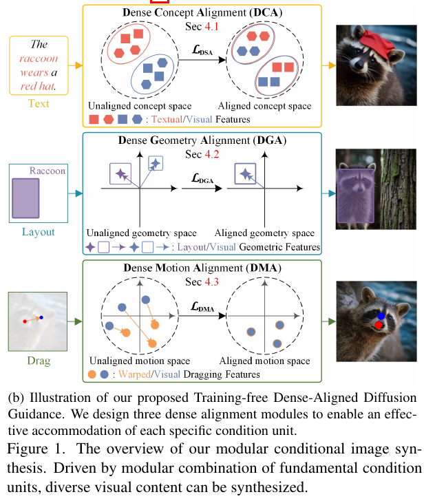

---

### DragLoRA: Online Optimization of LoRA Adapters for Drag-based Image Editing in Diffusion Model
 
 

 
\
2025-05-18\
**Authors:** Siwei Xia, Li Sun, Tiantian Sun, Qingli Li

Abstract

Drag-based editing within pretrained diffusion model provides a precise and flexible way to manipulate foreground objects. Traditional methods optimize the input feature obtained from DDIM inversion directly, adjusting them iteratively to guide handle points towards target locations. However, these approaches often suffer from limited accuracy due to the low representation ability of the feature in motion supervision, as well as inefficiencies caused by the large search space required for point tracking. To address these limitations, we present DragLoRA, a novel framework that integrates LoRA (Low-Rank Adaptation) adapters into the drag-based editing pipeline. To enhance the training of LoRA adapters, we introduce an additional denoising score distillation loss which regularizes the online model by aligning its output with that of the original model. Additionally, we improve the consistency of motion supervision by adapting the input features using the updated LoRA, giving a more stable and accurate input feature for subsequent operations. Building on this, we design an adaptive optimization scheme that dynamically toggles between two modes, prioritizing efficiency without compromising precision. Extensive experiments demonstrate that DragLoRA significantly enhances the control precision and computational efficiency for drag-based image editing.

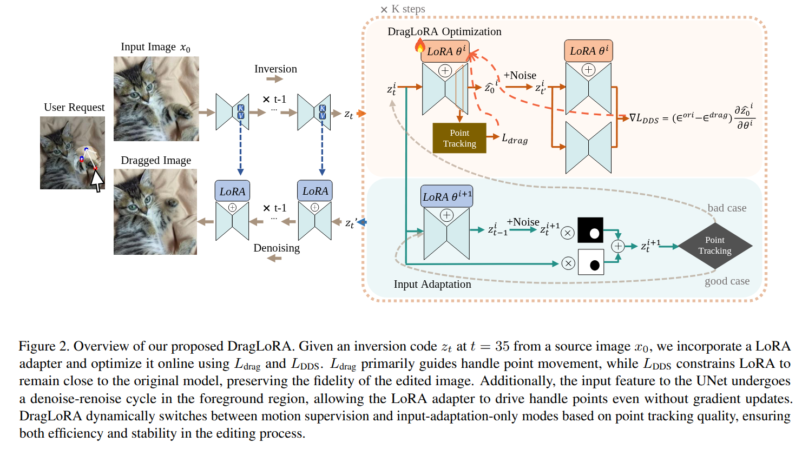

---

### DragNeXt: Rethinking Drag-Based Image Editing
 
 
\
2025-06-09\
**Authors:** Yuan Zhou, Junbao Zhou, Qingshan Xu, Kesen Zhao, Yuxuan Wang, Hao Fei, Richang Hong, Hanwang Zhang

Abstract

Drag-Based Image Editing (DBIE), which allows users to manipulate images by directly dragging objects within them, has recently attracted much attention from the community. However, it faces two key challenges: (\emph{\textcolor{magenta}{i}}) point-based drag is often highly ambiguous and difficult to align with users' intentions; (\emph{\textcolor{magenta}{ii}}) current DBIE methods primarily rely on alternating between motion supervision and point tracking, which is not only cumbersome but also fails to produce high-quality results. These limitations motivate us to explore DBIE from a new perspective -- redefining it as deformation, rotation, and translation of user-specified handle regions. Thereby, by requiring users to explicitly specify both drag areas and types, we can effectively address the ambiguity issue. Furthermore, we propose a simple-yet-effective editing framework, dubbed \textcolor{SkyBlue}{\textbf{DragNeXt}}. It unifies DBIE as a Latent Region Optimization (LRO) problem and solves it through Progressive Backward Self-Intervention (PBSI), simplifying the overall procedure of DBIE while further enhancing quality by fully leveraging region-level structure information and progressive guidance from intermediate drag states. We validate \textcolor{SkyBlue}{\textbf{DragNeXt}} on our NextBench, and extensive experiments demonstrate that our proposed method can significantly outperform existing approaches. 

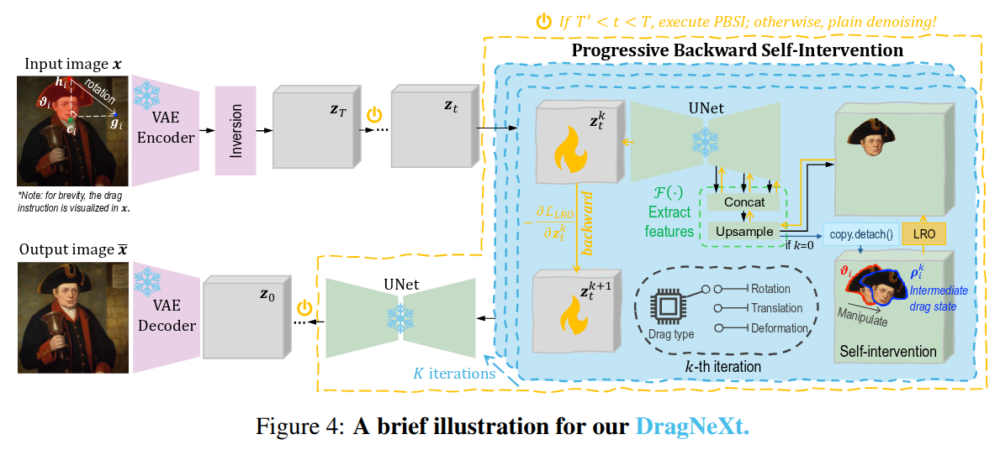

---

### AttentionDrag: Exploiting Latent Correlation Knowledge in Pre-trained Diffusion Models for Image Editing
 
 

 
\
2025-06-16\
**Authors:** Biao Yang, Muqi Huang, Yuhui Zhang, Yun Xiong, Kun Zhou, Xi Chen, Shiyang Zhou, Huishuai Bao, Chuan Li, Feng Shi, Hualei Liu

Abstract

Traditional point-based image editing methods rely on iterative latent optimization or geometric transformations, which are either inefficient in their processing or fail to capture the semantic relationships within the image. These methods often overlook the powerful yet underutilized image editing capabilities inherent in pre-trained diffusion models. In this work, we propose a novel one-step point-based image editing method, named AttentionDrag, which leverages the inherent latent knowledge and feature correlations within pre-trained diffusion models for image editing tasks. This framework enables semantic consistency and high-quality manipulation without the need for extensive re-optimization or retraining. Specifically, we reutilize the latent correlations knowledge learned by the self-attention mechanism in the U-Net module during the DDIM inversion process to automatically identify and adjust relevant image regions, ensuring semantic validity and consistency. Additionally, AttentionDrag adaptively generates masks to guide the editing process, enabling precise and context-aware modifications with friendly interaction. Our results demonstrate a performance that surpasses most state-of-the-art methods with significantly faster speeds, showing a more efficient and semantically coherent solution for point-based image editing tasks.

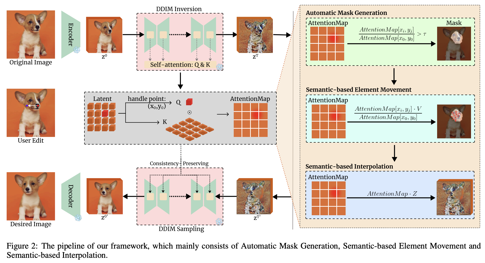

---

### FlowDrag: 3D-aware Drag-based Image Editing with Mesh-guided Deformation Vector Flow Fields
 
 

 
\
2025-07-11\
**Authors:** Gwanhyeong Koo, Sunjae Yoon, Younghwan Lee, Ji Woo Hong, Chang D. Yoo

Abstract

Drag-based editing allows precise object manipulation through point-based control, offering user convenience. However, current methods often suffer from a geometric inconsistency problem by focusing exclusively on matching user-defined points, neglecting the broader geometry and leading to artifacts or unstable edits. We propose FlowDrag, which leverages geometric information for more accurate and coherent transformations. Our approach constructs a 3D mesh from the image, using an energy function to guide mesh deformation based on user-defined drag points. The resulting mesh displacements are projected into 2D and incorporated into a UNet denoising process, enabling precise handle-to-target point alignment while preserving structural integrity. Additionally, existing drag-editing benchmarks provide no ground truth, making it difficult to assess how accurately the edits match the intended transformations. To address this, we present VFD (VidFrameDrag) benchmark dataset, which provides ground-truth frames using consecutive shots in a video dataset. FlowDrag outperforms existing drag-based editing methods on both VFD Bench and DragBench.

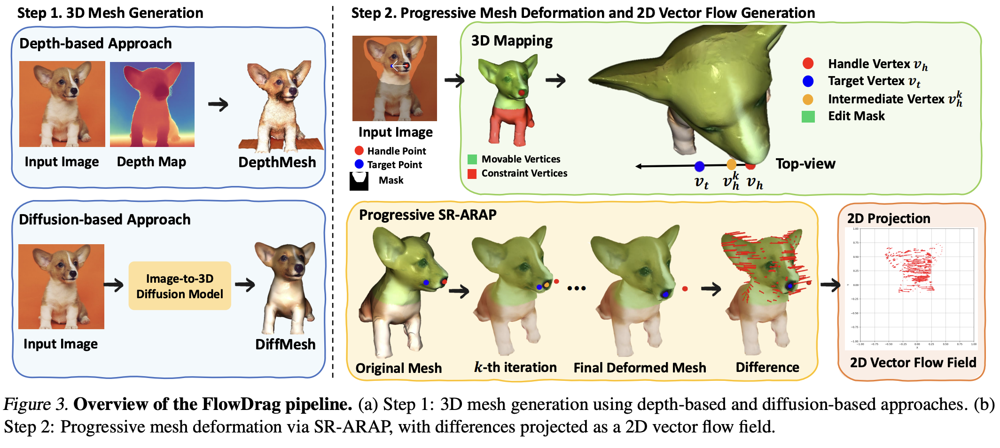

---

### AdaINDrag: AdaIN-Driven Point-Based Image Editing via Style-Guided Feature Optimization
 

 
\
2025-07-31\
**Authors:** Fei Lin, Yufeng Dong, Cong Zhang

Abstract

Precise and flexible image editing remains a central challenge in computer vision. Recent advances
in point-based interactive editing have enabled fine-grained image manipulation using sparse user-defined control points. DragDiffusion[36] pioneered the integration of diffusion models into this paradigm by leveraging latent space optimization to drive continuous structural transformations. However, its global optimization strategy often compromises semantic consistency and fine details. To address these limitations, we propose AdaINDrag, a novel framework that incorporates style alignment mechanisms into two critical stages of the diffusion process. During the latent optimization phase, we introduce a style-guided module that aligns the intermediate U-Net features with the original image’s style distribution, enhancing local semantic consistency under point-based guidance. In the subsequent denoising phase, we apply adaptive instance normalization to modulate key features within the attention mechanism, promoting better preservation of both image content and stylistic fidelity. Extensive experiments demonstrate that our method outperforms existing approaches in drag precision and image fidelity, delivering improved robustness and interactive efficiency for point-based image editing.

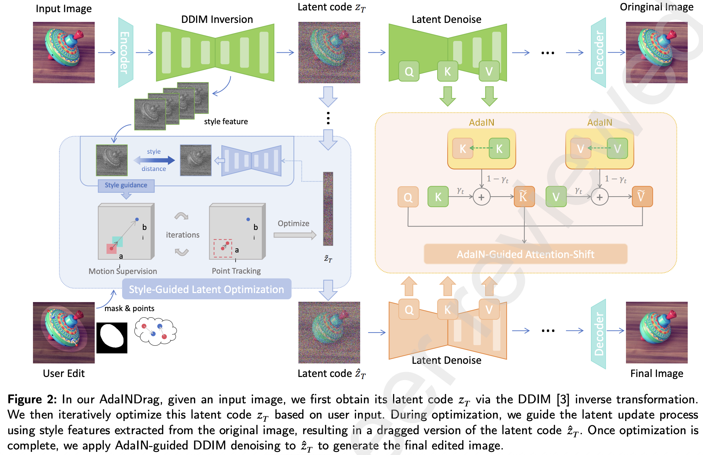

---

### LazyDrag: Enabling Stable Drag-Based Editing on Multi-Modal Diffusion Transformers via Explicit Correspondence
 

 
\
2025-09-15\
**Authors:** Zixin Yin, Xili Dai, Duomin Wang, Xianfang Zeng, Lionel M. Ni, Gang Yu, Heung-Yeung Shum

Abstract

The reliance on implicit point matching via attention has become a core bottleneck in drag-based editing, resulting in a fundamental compromise on weakened inversion strength and costly test-time optimization (TTO). This compromise severely limits the generative capabilities of diffusion models, suppressing high-fidelity inpainting and text-guided creation. In this paper, we introduce LazyDrag, the first drag-based image editing method for Multi-Modal Diffusion Transformers, which directly eliminates the reliance on implicit point matching. In concrete terms, our method generates an explicit correspondence map from user drag inputs as a reliable reference to boost the attention control. This reliable reference opens the potential for a stable full-strength inversion process, which is the first in the drag-based editing task. It obviates the necessity for TTO and unlocks the generative capability of models. Therefore, LazyDrag naturally unifies precise geometric control with text guidance, enabling complex edits that were previously out of reach: opening the mouth of a dog and inpainting its interior, generating new objects like a ``tennis ball'', or for ambiguous drags, making context-aware changes like moving a hand into a pocket. Additionally, LazyDrag supports multi-round workflows with simultaneous move and scale operations. Evaluated on the DragBench, our method outperforms baselines in drag accuracy and perceptual quality, as validated by VIEScore and human evaluation. LazyDrag not only establishes new state-of-the-art performance, but also paves a new way to editing paradigms.

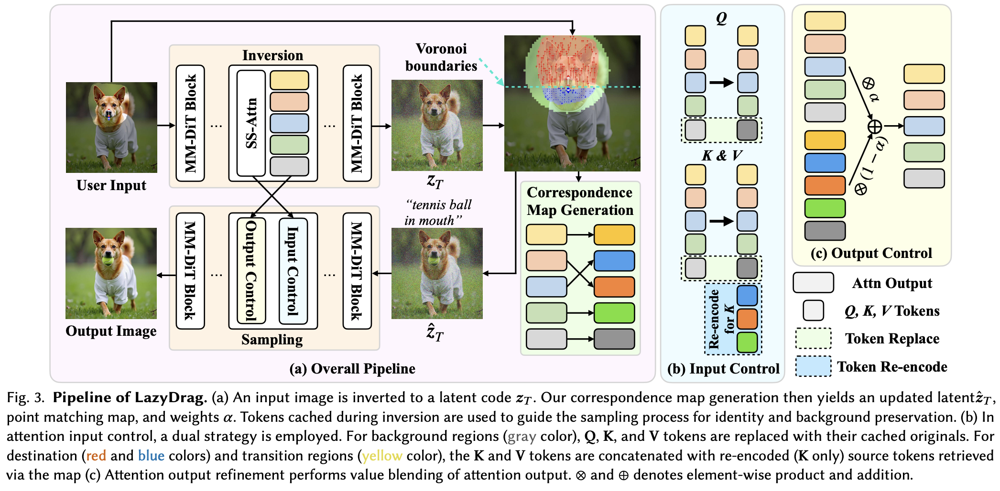

---

## Performance Improvement
### Diffeditor: Boosting accuracy and flexibility on diffusion-based image editing
 
 

 
\
2024-02-04\
**Authors:** Chong Mou, Xintao Wang, Jiechong Song, Ying Shan, Jian Zhang

Abstract

Large-scale Text-to-Image (T2I) diffusion models have revolutionized image generation over the last few years. Although owning diverse and high-quality generation capabilities, translating these abilities to fine-grained image editing remains challenging. In this paper, we propose DiffEditor to rectify two weaknesses in existing diffusion-based image editing: (1) in complex scenarios, editing results often lack editing accuracy and exhibit unexpected artifacts; (2) lack of flexibility to harmonize editing operations, e.g., imagine new content. In our solution, we introduce image prompts in fine-grained image editing, cooperating with the text prompt to better describe the editing content. To increase the flexibility while maintaining content consistency, we locally combine stochastic differential equation (SDE) into the ordinary differential equation (ODE) sampling. In addition, we incorporate regional score-based gradient guidance and a time travel strategy into the diffusion sampling, further improving the editing quality. Extensive experiments demonstrate that our method can efficiently achieve state-of-the-art performance on various fine-grained image editing tasks, including editing within a single image (e.g., object moving, resizing, and content dragging) and across images (e.g., appearance replacing and object pasting).

---

### EasyDrag: Efficient Point-based Manipulation on Diffusion Models
 

 
\
2024-03-20\
**Authors:** Hou, Xingzhong and Liu, Boxiao and Zhang, Yi and Liu, Jihao and Liu, Yu and You, Haihang

Abstract

Generative models are gaining increasing popularity, and the demand for precisely generating images is on the rise. However, generating an image that perfectly aligns with users’ expectations is extremely challenging. The shapes of objects, the poses of animals, the structures of landscapes, and more may not match the user’s desires, and this applies to real images as well. This is where point- based image editing becomes essential. An excellent im- age editing method needs to meet the following criteria: user-friendly interaction, high performance, and good gen- eralization capability. Due to the limitations of StyleGAN, DragGAN exhibits limited robustness across diverse sce- narios, while DragDiffusion lacks user-friendliness due to the necessity of LoRA fine-tuning and masks. In this paper, we introduce a novel interactive point-based image edit- ing framework, called EasyDrag, that leverages pretrained diffusion models to achieve high-quality editing outcomes and user-friendship. Extensive experimentation demon- strates that our approach surpasses DragDiffusion in terms of both image quality and editing precision for point-based image manipulation tasks.

---

### LightningDrag: Lightning Fast and Accurate Drag-based Image Editing Emerging from Videos
 

 
\
2024-05-22\
**Authors:** Yujun Shi, Jun Hao Liew, Hanshu Yan, Vincent Y. F. Tan, Jiashi Feng

Abstract

Accuracy and speed are critical in image editing tasks. Pan et al. introduced a drag-based image editing framework that achieves pixel-level control using Generative Adversarial Networks (GANs). A flurry of subsequent studies enhanced this framework's generality by leveraging large-scale diffusion models. However, these methods often suffer from inordinately long processing times (exceeding 1 minute per edit) and low success rates. Addressing these issues head on, we present LightningDrag, a rapid approach enabling high quality drag-based image editing in ~1 second. Unlike most previous methods, we redefine drag-based editing as a conditional generation task, eliminating the need for time-consuming latent optimization or gradient-based guidance during inference. In addition, the design of our pipeline allows us to train our model on large-scale paired video frames, which contain rich motion information such as object translations, changing poses and orientations, zooming in and out, etc. By learning from videos, our approach can significantly outperform previous methods in terms of accuracy and consistency. Despite being trained solely on videos, our model generalizes well to perform local shape deformations not presented in the training data (e.g., lengthening of hair, twisting rainbows, etc.). Extensive qualitative and quantitative evaluations on benchmark datasets corroborate the superiority of our approach. 

---

### FastDrag: Manipulate Anything in One Step
 
 

 
\
2024-05-24\
**Authors:** Xuanjia Zhao, Jian Guan, Congyi Fan, Dongli Xu, Youtian Lin, Haiwei Pan, Pengming Feng

Abstract

Drag-based image editing using generative models provides precise control over image contents, enabling users to manipulate anything in an image with a few clicks. However, prevailing methods typically adopt n-step iterations for latent semantic optimization to achieve drag-based image editing, which is time-consuming and limits practical applications. In this paper, we introduce a novel one-step drag-based image editing method, i.e., FastDrag, to accelerate the editing process. Central to our approach is a latent warpage function (LWF), which simulates the behavior of a stretched material to adjust the location of individual pixels within the latent space. This innovation achieves one-step latent semantic optimization and hence significantly promotes editing speeds. Meanwhile, null regions emerging after applying LWF are addressed by our proposed bilateral nearest neighbor interpolation (BNNI) strategy. This strategy interpolates these regions using similar features from neighboring areas, thus enhancing semantic integrity. Additionally, a consistency-preserving strategy is introduced to maintain the consistency between the edited and original images by adopting semantic information from the original image, saved as key and value pairs in self-attention module during diffusion inversion, to guide the diffusion sampling. Our FastDrag is validated on the DragBench dataset, demonstrating substantial improvements in processing time over existing methods, while achieving enhanced editing performance. 

---

### Auto DragGAN: Editing the Generative Image Manifold in an Autoregressive Manner
 
 
 
\
2024-07-26\
**Authors:** Pengxiang Cai, Zhiwei Liu, Guibo Zhu, Yunfang Niu, Jinqiao Wang

Abstract

Pixel-level fine-grained image editing remains an open challenge. Previous works fail to achieve an ideal trade-off between control granularity and inference speed. They either fail to achieve pixel-level fine-grained control, or their inference speed requires optimization. To address this, this paper for the first time employs a regression-based network to learn the variation patterns of StyleGAN latent codes during the image dragging process. This method enables pixel-level precision in dragging editing with little time cost. Users can specify handle points and their corresponding target points on any GAN-generated images, and our method will move each handle point to its corresponding target point. Through experimental analysis, we discover that a short movement distance from handle points to target points yields a high-fidelity edited image, as the model only needs to predict the movement of a small portion of pixels. To achieve this, we decompose the entire movement process into multiple sub-processes. Specifically, we develop a transformer encoder-decoder based network named 'Latent Predictor' to predict the latent code motion trajectories from handle points to target points in an autoregressive manner. Moreover, to enhance the prediction stability, we introduce a component named 'Latent Regularizer', aimed at constraining the latent code motion within the distribution of natural images. Extensive experiments demonstrate that our method achieves state-of-the-art (SOTA) inference speed and image editing performance at the pixel-level granularity.

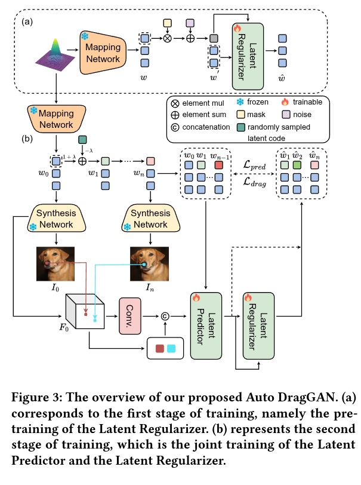

---

### InstantDrag: Improving Interactivity in Drag-based Image Editing
 
 

 
\
2024-09-13\
**Authors:** Joonghyuk Shin, Daehyeon Choi, Jaesik Park

Abstract

Drag-based image editing has recently gained popularity for its interactivity and precision. However, despite the ability of text-to-image models to generate samples within a second, drag editing still lags behind due to the challenge of accurately reflecting user interaction while maintaining image content. Some existing approaches rely on computationally intensive per-image optimization or intricate guidance-based methods, requiring additional inputs such as masks for movable regions and text prompts, thereby compromising the interactivity of the editing process. We introduce InstantDrag, an optimization-free pipeline that enhances interactivity and speed, requiring only an image and a drag instruction as input. InstantDrag consists of two carefully designed networks: a drag-conditioned optical flow generator (FlowGen) and an optical flow-conditioned diffusion model (FlowDiffusion). InstantDrag learns motion dynamics for drag-based image editing in real-world video datasets by decomposing the task into motion generation and motion-conditioned image generation. We demonstrate InstantDrag's capability to perform fast, photo-realistic edits without masks or text prompts through experiments on facial video datasets and general scenes. These results highlight the efficiency of our approach in handling drag-based image editing, making it a promising solution for interactive, real-time applications.

---

### EEdit: Rethinking the Spatial and Temporal Redundancy for Efficient Image Editing
 

 
\
2025-03-13\
**Authors:** Zexuan Yan, Yue Ma, Chang Zou, Wenteng Chen, Qifeng Chen, Linfeng Zhang

Abstract

Inversion-based image editing is rapidly gaining momentum while suffering from significant computation overhead, hindering its application in real-time interactive scenarios. In this paper, we rethink that the redundancy in inversion-based image editing exists in both the spatial and temporal dimensions, such as the unnecessary computation in unedited regions and the redundancy in the inversion progress. To tackle these challenges, we propose a practical framework, named EEdit, to achieve efficient image editing. Specifically, we introduce three techniques to solve them one by one. For spatial redundancy, spatial locality caching is introduced to compute the edited region and its neighboring regions while skipping the unedited regions, and token indexing preprocessing is designed to further accelerate the caching. For temporal redundancy, inversion step skipping is proposed to reuse the latent for efficient editing. Our experiments demonstrate an average of 2.46 × acceleration without performance drop in a wide range of editing tasks including prompt-guided image editing, dragging and image composition. 

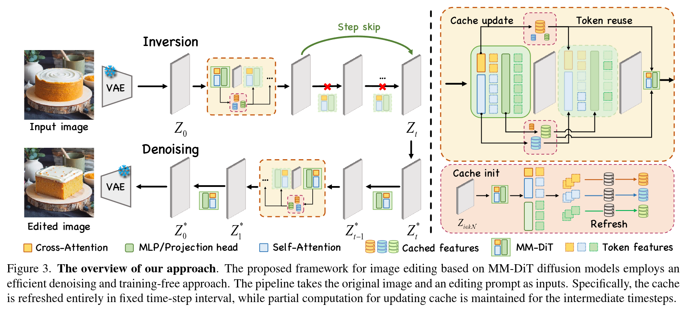

---

## Novel View Perspective

### Readout Guidance: Learning Control from Diffusion Features
 
 

 
\
2023-12-04\
**Authors:** Grace Luo, Trevor Darrell, Oliver Wang, Dan B Goldman, Aleksander Holynski

Abstract

We present Readout Guidance, a method for controlling text-to-image diffusion models with learned signals. Readout Guidance uses readout heads, lightweight networks trained to extract signals from the features of a pre-trained, frozen diffusion model at every timestep. These readouts can encode single-image properties, such as pose, depth, and edges; or higher-order properties that relate multiple images, such as correspondence and appearance similarity. Furthermore, by comparing the readout estimates to a user-defined target, and back-propagating the gradient through the readout head, these estimates can be used to guide the sampling process. Compared to prior methods for conditional generation, Readout Guidance requires significantly fewer added parameters and training samples, and offers a convenient and simple recipe for reproducing different forms of conditional control under a single framework, with a single architecture and sampling procedure. We showcase these benefits in the applications of drag-based manipulation, identity-consistent generation, and spatially aligned control.

---

### RegionDrag: Fast Region-Based Image Editing with Diffusion Models
 
 

 
\
2024-07-25\
**Authors:** Jingyi Lu, Xinghui Li, Kai Han

Abstract

Point-drag-based image editing methods, like DragDiffusion, have attracted significant attention. However, point-drag-based approaches suffer from computational overhead and misinterpretation of user intentions due to the sparsity of point-based editing instructions. In this paper, we propose a region-based copy-and-paste dragging method, RegionDrag, to overcome these limitations. RegionDrag allows users to express their editing instructions in the form of handle and target regions, enabling more precise control and alleviating ambiguity. In addition, region-based operations complete editing in one iteration and are much faster than point-drag-based methods. We also incorporate the attention-swapping technique for enhanced stability during editing. To validate our approach, we extend existing point-drag-based datasets with region-based dragging instructions. Experimental results demonstrate that RegionDrag outperforms existing point-drag-based approaches in terms of speed, accuracy, and alignment with user intentions. Remarkably, RegionDrag completes the edit on an image with a resolution of 512x512 in less than 2 seconds, which is more than 100x faster than DragDiffusion, while achieving better performance. 

---

### FramePainter: Endowing Interactive Image Editing with Video Diffusion Priors
 

 
\
2025-01-14\
**Authors:** Yabo Zhang, Xinpeng Zhou, Yihan Zeng, Hang Xu, Hui Li, Wangmeng Zuo

Abstract

Interactive image editing allows users to modify images through visual interaction operations such as drawing, clicking, and dragging. Existing methods construct such supervision signals from videos, as they capture how objects change with various physical interactions. However, these models are usually built upon text-to-image diffusion models, so necessitate (i) massive training samples and (ii) an additional reference encoder to learn real-world dynamics and visual consistency. In this paper, we reformulate this task as an image-to-video generation problem, so that inherit powerful video diffusion priors to reduce training costs and ensure temporal consistency. Specifically, we introduce FramePainter as an efficient instantiation of this formulation. Initialized with Stable Video Diffusion, it only uses a lightweight sparse control encoder to inject editing signals. Considering the limitations of temporal attention in handling large motion between two frames, we further propose matching attention to enlarge the receptive field while encouraging dense correspondence between edited and source image tokens. We highlight the effectiveness and efficiency of FramePainter across various of editing signals: it domainantly outperforms previous state-of-the-art methods with far less training data, achieving highly seamless and coherent editing of images, \eg, automatically adjust the reflection of the cup. Moreover, FramePainter also exhibits exceptional generalization in scenarios not present in real-world videos, \eg, transform the clownfish into shark-like shape. 

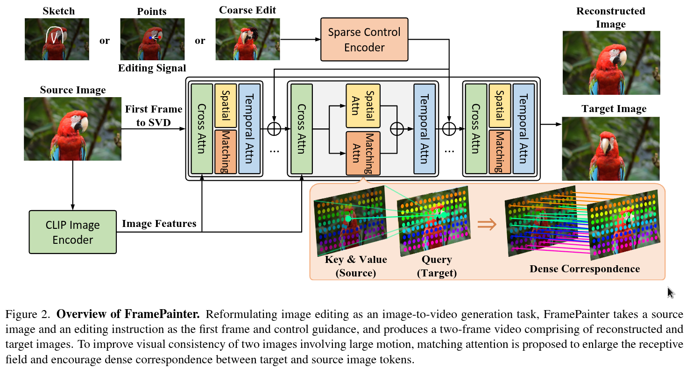

---

### MotionDiff: Training-free Zero-shot Interactive Motion Editing via Flow-assisted Multi-view Diffusion
 
 
\
2025-03-22\
**Authors:** Yikun Ma, Yiqing Li, Jiawei Wu, Xing Luo, Zhi Jin

Abstract

Generative models have made remarkable advancements and are capable of producing high-quality content. However, performing controllable editing with generative models remains challenging, due to their inherent uncertainty in outputs. This challenge is praticularly pronounced in motion editing, which involves the processing of spatial information. While some physics-based generative methods have attempted to implement motion editing, they typically operate on single-view images with simple motions, such as translation and dragging. These methods struggle to handle complex rotation and stretching motions and ensure multi-view consistency, often necessitating resource-intensive retraining. To address these challenges, we propose MotionDiff, a training-free zero-shot diffusion method that leverages optical flow for complex multi-view motion editing. Specifically, given a static scene, users can interactively select objects of interest to add motion priors. The proposed Point Kinematic Model (PKM) then estimates corresponding multi-view optical flows during the Multi-view Flow Estimation Stage (MFES). Subsequently, these optical flows are utilized to generate multi-view motion results through decoupled motion representation in the Multi-view Motion Diffusion Stage (MMDS). Extensive experiments demonstrate that MotionDiff outperforms other physics-based generative motion editing methods in achieving high-quality multi-view consistent motion results. Notably, MotionDiff does not require retraining, enabling users to conveniently adapt it for various down-stream tasks.

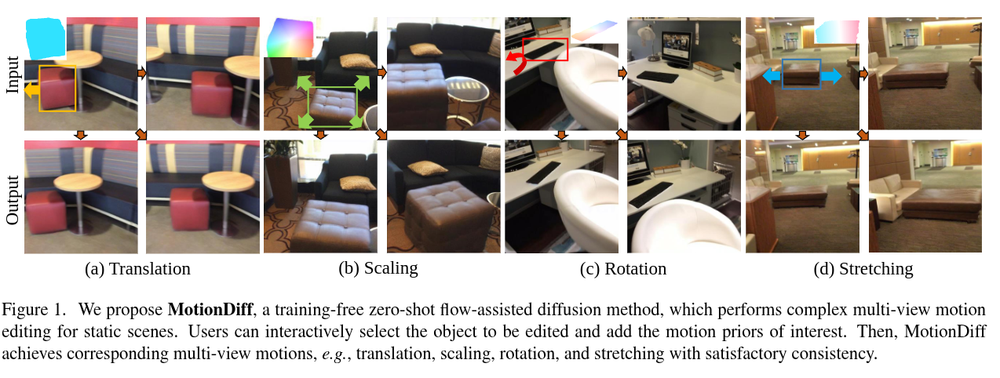

---

### Inpaint4Drag: Repurposing Inpainting Models for Drag-Based Image Editing via Bidirectional Warping
 
 

 
\
2025-09-04\
**Authors:** Jingyi Lu, Kai Han

Abstract

Drag-based image editing has emerged as a powerful paradigm for intuitive image manipulation. However, existing approaches predominantly rely on manipulating the latent space of generative models, leading to limited precision, delayed feedback, and model-specific constraints. Accordingly, we present Inpaint4Drag, a novel framework that decomposes drag-based editing into pixel-space bidirectional warping and image inpainting. Inspired by elastic object deformation in the physical world, we treat image regions as deformable materials that maintain natural shape under user manipulation. Our method achieves real-time warping previews (0.01s) and efficient inpainting (0.3s) at 512x512 resolution, significantly improving the interaction experience compared to existing methods that require minutes per edit. By transforming drag inputs directly into standard inpainting formats, our approach serves as a universal adapter for any inpainting model without architecture modification, automatically inheriting all future improvements in inpainting technology. Extensive experiments demonstrate that our method achieves superior visual quality and precise control while maintaining real-time performance.

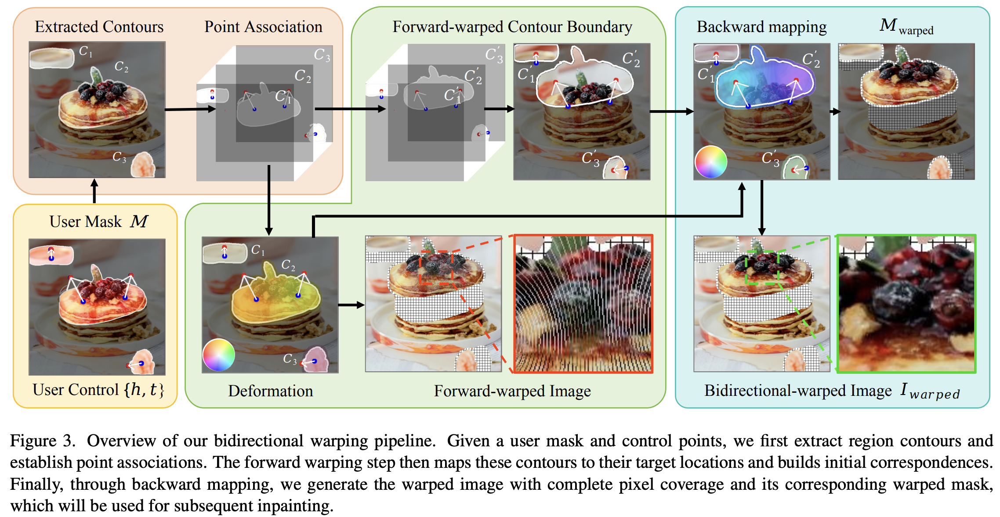

---

## Novel View Application

### Edit One for All: Interactive Batch Image Editing
 
 

 
\
2024-01-18\
**Authors:** Thao Nguyen, Utkarsh Ojha, Yuheng Li, Haotian Liu, Yong Jae Lee

Abstract

In recent years, image editing has advanced remarkably. With increased human control, it is now possible to edit an image in a plethora of ways; from specifying in text what we want to change, to straight up dragging the contents of the image in an interactive point-based manner. However, most of the focus has remained on editing single images at a time. Whether and how we can simultaneously edit large batches of images has remained understudied. With the goal of minimizing human supervision in the editing process, this paper presents a novel method for interactive batch image editing using StyleGAN as the medium. Given an edit specified by users in an example image (e.g., make the face frontal), our method can automatically transfer that edit to other test images, so that regardless of their initial state (pose), they all arrive at the same final state (e.g., all facing front). Extensive experiments demonstrate that edits performed using our method have similar visual quality to existing single-image-editing methods, while having more visual consistency and saving significant time and human effort.

---

### DragTex: Generative Point-Based Texture Editing on 3D Mesh
 
 
\
2024-03-04\
**Authors:** Yudi Zhang, Qi Xu, Lei Zhang

Abstract

Creating 3D textured meshes using generative artificial intelligence has garnered significant attention recently. While existing methods support text-based generative texture generation or editing on 3D meshes, they often struggle to precisely control pixels of texture images through more intuitive interaction. While 2D images can be edited generatively using drag interaction, applying this type of methods directly to 3D mesh textures still leads to issues such as the lack of local consistency among multiple views, error accumulation and long training times. To address these challenges, we propose a generative point-based 3D mesh texture editing method called DragTex. This method utilizes a diffusion model to blend locally inconsistent textures in the region near the deformed silhouette between different views, enabling locally consistent texture editing. Besides, we fine-tune a decoder to reduce reconstruction errors in the non-drag region, thereby mitigating overall error accumulation. Moreover, we train LoRA using multi-view images instead of training each view individually, which significantly shortens the training time. The experimental results show that our method effectively achieves dragging textures on 3D meshes and generates plausible textures that align with the desired intent of drag interaction.

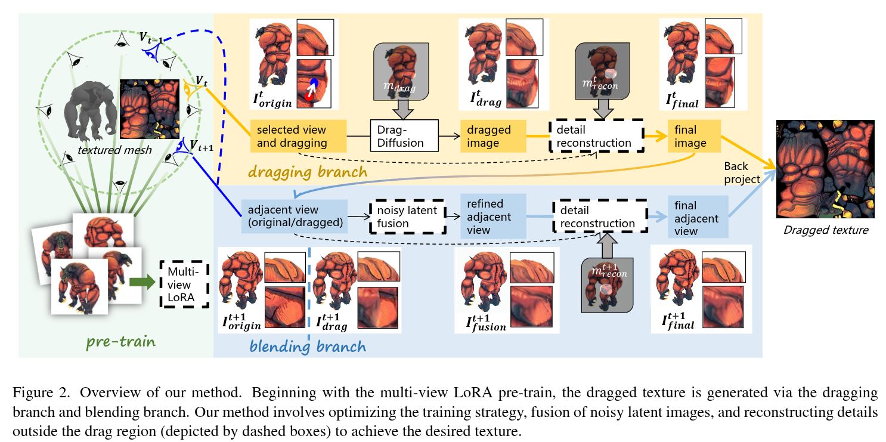

---

### Dragapart: Learning a part-level motion prior for articulated objects
 
 

 
\
2024-03-22\
**Authors:** Ruining Li, Chuanxia Zheng, Christian Rupprecht, Andrea Vedaldi

Abstract

We introduce DragAPart, a method that, given an image and a set of drags as input, generates a new image of the same object that responds to the action of the drags. Differently from prior works that focused on repositioning objects, DragAPart predicts part-level interactions, such as opening and closing a drawer. We study this problem as a proxy for learning a generalist motion model, not restricted to a specific kinematic structure or object category. We start from a pre-trained image generator and fine-tune it on a new synthetic dataset, Drag-a-Move, which we introduce. Combined with a new encoding for the drags and dataset randomization, the model generalizes well to real images and different categories. Compared to prior motion-controlled generators, we demonstrate much better part-level motion understanding.

---

### DragTraffic: Interactive and Controllable Traffic Scene Generation for Autonomous Driving
 
 

 
\
2024-04-19\
**Authors:** Sheng Wang, Ge Sun, Fulong Ma, Tianshuai Hu, Qiang Qin, Yongkang Song, Lei Zhu, Junwei Liang

Abstract

Evaluating and training autonomous driving systems require diverse and scalable corner cases. However, most existing scene generation methods lack controllability, accuracy, and versatility, resulting in unsatisfactory generation results. Inspired by DragGAN in image generation, we propose DragTraffic, a generalized, interactive, and controllable traffic scene generation framework based on conditional diffusion. DragTraffic enables non-experts to generate a variety of realistic driving scenarios for different types of traffic agents through an adaptive mixture expert architecture. We employ a regression model to provide a general initial solution and a refinement process based on the conditional diffusion model to ensure diversity. User-customized context is introduced through cross-attention to ensure high controllability. Experiments on a real-world driving dataset show that DragTraffic outperforms existing methods in terms of authenticity, diversity, and freedom. 

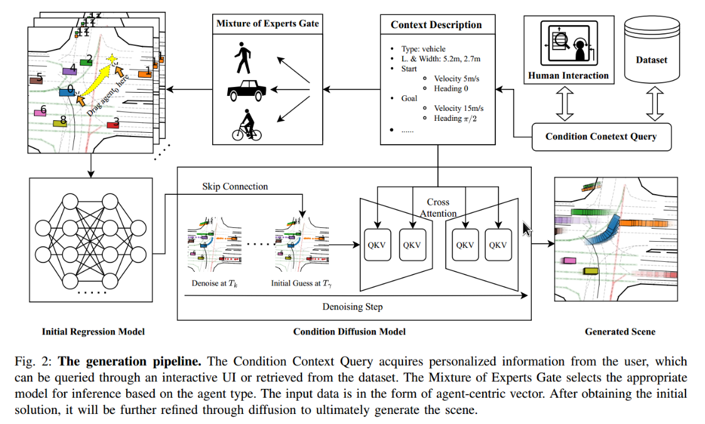

---

## Video Drag Editing
### DragVideo: Interactive Drag-style Video Editing
 
 

 
\
2023-12-03\
**Authors:** Yufan Deng, Ruida Wang, Yuhao Zhang, Yu-Wing Tai, Chi-Keung Tang

Abstract

Video generation models have shown their superior ability to generate photo-realistic video. However, how to accurately control (or edit) the video remains a formidable challenge. The main issues are: 1) how to perform direct and accurate user control in editing; 2) how to execute editings like changing shape, expression, and layout without unsightly distortion and artifacts to the edited content; and 3) how to maintain spatio-temporal consistency of video after editing. To address the above issues, we propose DragVideo, a general drag-style video editing framework. Inspired by DragGAN, DragVideo addresses issues 1) and 2) by proposing the drag-style video latent optimization method which gives desired control by updating noisy video latent according to drag instructions through video-level drag objective function. We amend issue 3) by integrating the video diffusion model with sample-specific LoRA and Mutual Self-Attention in DragVideo to ensure the edited result is spatio-temporally consistent. We also present a series of testing examples for drag-style video editing and conduct extensive experiments across a wide array of challenging editing tasks, such as motion, skeleton editing, etc, underscoring DragVideo can edit video in an intuitive, faithful to the user's intention manner, with nearly unnoticeable distortion and artifacts, while maintaining spatio-temporal consistency. While traditional prompt-based video editing fails to do the former two and directly applying image drag editing fails in the last, DragVideo's versatility and generality are emphasized.

---

### Drag-A-Video: Non-rigid Video Editing with Point-based Interaction
 

 
\
2023-12-05\
**Authors:** Yao Teng, Enze Xie, Yue Wu, Haoyu Han, Zhenguo Li, Xihui Liu

Abstract

Video editing is a challenging task that requires manipulating videos on both the spatial and temporal dimensions. Existing methods for video editing mainly focus on changing the appearance or style of the objects in the video, while keeping their structures unchanged. However, there is no existing method that allows users to interactively ``drag'' any points of instances on the first frame to precisely reach the target points with other frames consistently deformed. In this paper, we propose a new diffusion-based method for interactive point-based video manipulation, called Drag-A-Video. Our method allows users to click pairs of handle points and target points as well as masks on the first frame of an input video. Then, our method transforms the inputs into point sets and propagates these sets across frames. To precisely modify the contents of the video, we employ a new video-level motion supervision to update the features of the video and introduce the latent offsets to achieve this update at multiple denoising timesteps. We propose a temporal-consistent point tracking module to coordinate the movement of the points in the handle point sets. We demonstrate the effectiveness and flexibility of our method on various videos. 

---

### VideoHandles: Editing 3D Object Compositions in Videos Using Video Generative Priors
 
 

 
\
2025-03-03\
**Authors:** Juil Koo, Paul Guerrero, Chun-Hao Paul Huang, Duygu Ceylan, Minhyuk Sung

Abstract

Generative methods for image and video editing use generative models as priors to perform edits despite incomplete information, such as changing the composition of 3D objects shown in a single image. Recent methods have shown promising composition editing results in the image setting, but in the video setting, editing methods have focused on editing object's appearance and motion, or camera motion, and as a result, methods to edit object composition in videos are still missing. We propose \name as a method for editing 3D object compositions in videos of static scenes with camera motion. Our approach allows editing the 3D position of a 3D object across all frames of a video in a temporally consistent manner. This is achieved by lifting intermediate features of a generative model to a 3D reconstruction that is shared between all frames, editing the reconstruction, and projecting the features on the edited reconstruction back to each frame. To the best of our knowledge, this is the first generative approach to edit object compositions in videos. Our approach is simple and training-free, while outperforming state-of-the-art image editing baselines.

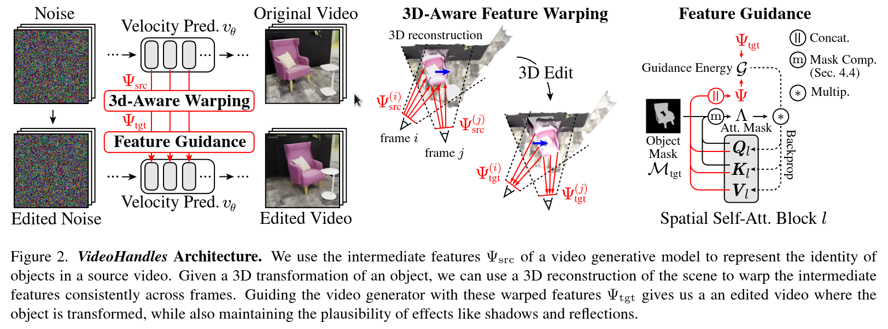

---

## Video Generation
### DragNUWA: Fine-grained Control in Video Generation by Integrating Text, Image, and Trajectory
 

 
\
2023-08-16\
**Authors:** Shengming Yin, Chenfei Wu, Jian Liang, Jie Shi, Houqiang Li, Gong Ming, Nan Duan

Abstract

Controllable video generation has gained significant attention in recent years. However, two main limitations persist: Firstly, most existing works focus on either text, image, or trajectory-based control, leading to an inability to achieve fine-grained control in videos. Secondly, trajectory control research is still in its early stages, with most experiments being conducted on simple datasets like Human3.6M. This constraint limits the models' capability to process open-domain images and effectively handle complex curved trajectories. In this paper, we propose DragNUWA, an open-domain diffusion-based video generation model. To tackle the issue of insufficient control granularity in existing works, we simultaneously introduce text, image, and trajectory information to provide fine-grained control over video content from semantic, spatial, and temporal perspectives. To resolve the problem of limited open-domain trajectory control in current research, We propose trajectory modeling with three aspects: a Trajectory Sampler (TS) to enable open-domain control of arbitrary trajectories, a Multiscale Fusion (MF) to control trajectories in different granularities, and an Adaptive Training (AT) strategy to generate consistent videos following trajectories. Our experiments validate the effectiveness of DragNUWA, demonstrating its superior performance in fine-grained control in video generation.

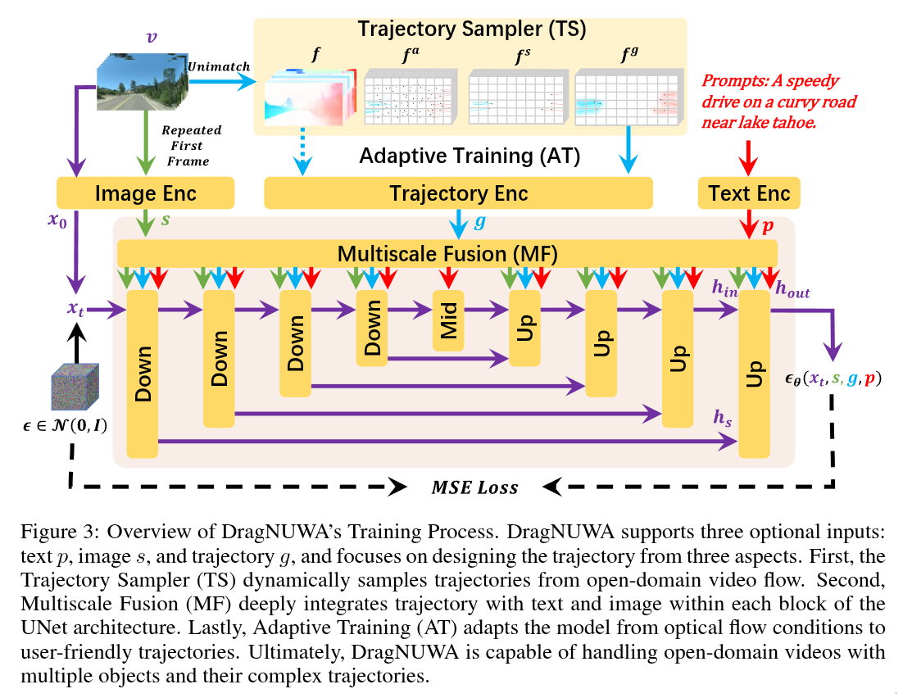

---

### DragAnything: Motion Control for Anything using Entity Representation
 
 

 
\
2024-03-12\
**Authors:** Weijia Wu, Zhuang Li, Yuchao Gu, Rui Zhao, Yefei He, David Junhao Zhang, Mike Zheng Shou, Yan Li, Tingting Gao, Di Zhang

Abstract

We introduce DragAnything, which utilizes a entity representation to achieve motion control for any object in controllable video generation. Comparison to existing motion control methods, DragAnything offers several advantages. Firstly, trajectory-based is more userfriendly for interaction, when acquiring other guidance signals (e.g., masks, depth maps) is labor-intensive. Users only need to draw a line (trajectory) during interaction. Secondly, our entity representation serves as an open-domain embedding capable of representing any object, enabling the control of motion for diverse entities, including background. Lastly, our entity representation allows simultaneous and distinct motion control for multiple objects. Extensive experiments demonstrate that our DragAnything achieves state-of-the-art performance for FVD, FID, and User Study, particularly in terms of object motion control, where our method surpasses the previous methods (e.g., DragNUWA) by 26% in human voting.

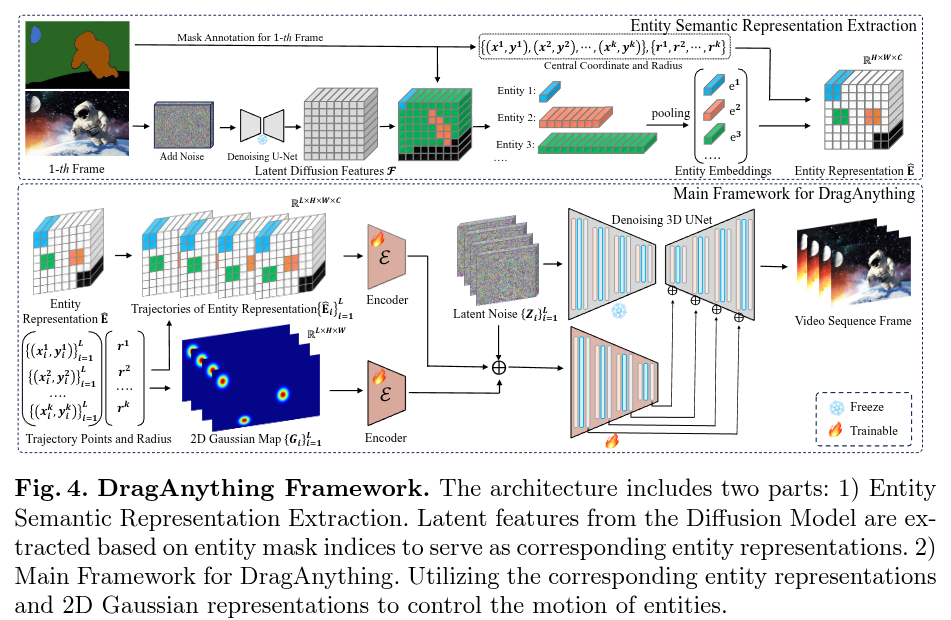

---

### DragEntity: Trajectory Guided Video Generation using Entity and Positional Relationships
 
 
 
\
2024-10-14\
**Authors:** Zhang Wan, Sheng Tang, Jiawei Wei, Ruize Zhang, Juan Cao

Abstract

In recent years, diffusion models have achieved tremendous success in the field of video generation, with controllable video generation receiving significant attention. However, existing control methods still face two limitations: Firstly, control conditions (such as depth maps, 3D Mesh) are difficult for ordinary users to obtain directly. Secondly, it's challenging to drive multiple objects through complex motions with multiple trajectories simultaneously. In this paper, we introduce DragEntity, a video generation model that utilizes entity representation for controlling the motion of multiple objects. Compared to previous methods, DragEntity offers two main advantages: 1) Our method is more user-friendly for interaction because it allows users to drag entities within the image rather than individual pixels. 2) We use entity representation to represent any object in the image, and multiple objects can maintain relative spatial relationships. Therefore, we allow multiple trajectories to control multiple objects in the image with different levels of complexity simultaneously. Our experiments validate the effectiveness of DragEntity, demonstrating its excellent performance in fine-grained control in video generation.

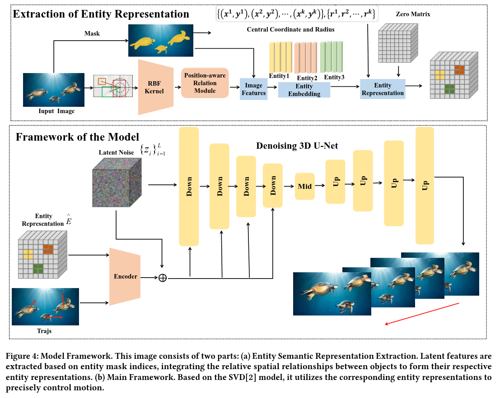

---

### OmniDrag: Enabling Motion Control for Omnidirectional Image-to-Video Generation
 

 
\
2024-12-12\
**Authors:** Weiqi Li, Shijie Zhao, Chong Mou, Xuhan Sheng, Zhenyu Zhang, Qian Wang, Junlin Li, Li Zhang, Jian Zhang

Abstract

As virtual reality gains popularity, the demand for controllable creation of immersive and dynamic omnidirectional videos (ODVs) is increasing. While previous text-to-ODV generation methods achieve impressive results, they struggle with content inaccuracies and inconsistencies due to reliance solely on textual inputs. Although recent motion control techniques provide fine-grained control for video generation, directly applying these methods to ODVs often results in spatial distortion and unsatisfactory performance, especially with complex spherical motions. To tackle these challenges, we propose OmniDrag, the first approach enabling both scene- and object-level motion control for accurate, high-quality omnidirectional image-to-video generation. Building on pretrained video diffusion models, we introduce an omnidirectional control module, which is jointly fine-tuned with temporal attention layers to effectively handle complex spherical motion. In addition, we develop a novel spherical motion estimator that accurately extracts motion-control signals and allows users to perform drag-style ODV generation by simply drawing handle and target points. We also present a new dataset, named Move360, addressing the scarcity of ODV data with large scene and object motions. Experiments demonstrate the significant superiority of OmniDrag in achieving holistic scene-level and fine-grained object-level control for ODV generation.

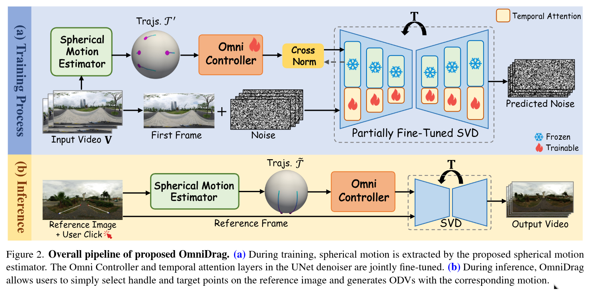

---

### LeviTor: 3D Trajectory Oriented Image-to-Video Synthesis
 

 
\
2024-12-19\
**Authors:** Hanlin Wang, Hao Ouyang, Qiuyu Wang, Wen Wang, Ka Leong Cheng, Qifeng Chen, Yujun Shen, Limin Wang

Abstract

The intuitive nature of drag-based interaction has led to its growing adoption for controlling object trajectories in image-to-video synthesis. Still, existing methods that perform dragging in the 2D space usually face ambiguity when handling out-of-plane movements. In this work, we augment the interaction with a new dimension, i.e., the depth dimension, such that users are allowed to assign a relative depth for each point on the trajectory. That way, our new interaction paradigm not only inherits the convenience from 2D dragging, but facilitates trajectory control in the 3D space, broadening the scope of creativity. We propose a pioneering method for 3D trajectory control in image-to-video synthesis by abstracting object masks into a few cluster points. These points, accompanied by the depth information and the instance information, are finally fed into a video diffusion model as the control signal. Extensive experiments validate the effectiveness of our approach, dubbed LeviTor, in precisely manipulating the object movements when producing photo-realistic videos from static images.

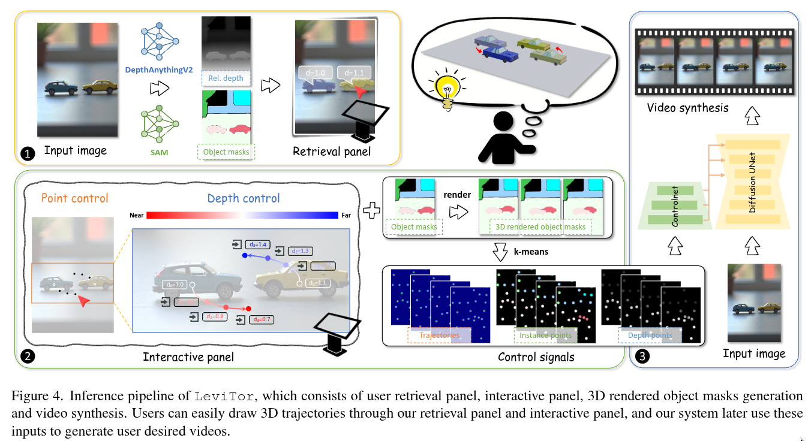

---

### C-Drag: Chain-of-Thought Driven Motion Controller for Video Generation
 

 
\
2025-02-27\
**Authors:** Yuhao Li, Mirana Claire Angel, Salman Khan, Yu Zhu, Jinqiu Sun, Yanning Zhang, Fahad Shahbaz Khan

Abstract

Trajectory-based motion control has emerged as an intuitive and efficient approach for controllable video generation. However, the existing trajectory-based approaches are usually limited to only generating the motion trajectory of the controlled object and ignoring the dynamic interactions between the controlled object and its surroundings. To address this limitation, we propose a Chain-of-Thought-based motion controller for controllable video generation, named C-Drag. Instead of directly generating the motion of some objects, our C-Drag first performs object perception and then reasons the dynamic interactions between different objects according to the given motion control of the objects. Specifically, our method includes an object perception module and a Chain-of-Thought-based motion reasoning module. The object perception module employs visual language models to capture the position and category information of various objects within the image. The Chain-of-Thought-based motion reasoning module takes this information as input and conducts a stage-wise reasoning process to generate motion trajectories for each of the affected objects, which are subsequently fed to the diffusion model for video synthesis. Furthermore, we introduce a new video object interaction (VOI) dataset to evaluate the generation quality of motion controlled video generation methods. Our VOI dataset contains three typical types of interactions and provides the motion trajectories of objects that can be used for accurate performance evaluation. Experimental results show that C-Drag achieves promising performance across multiple metrics, excelling in object motion control.

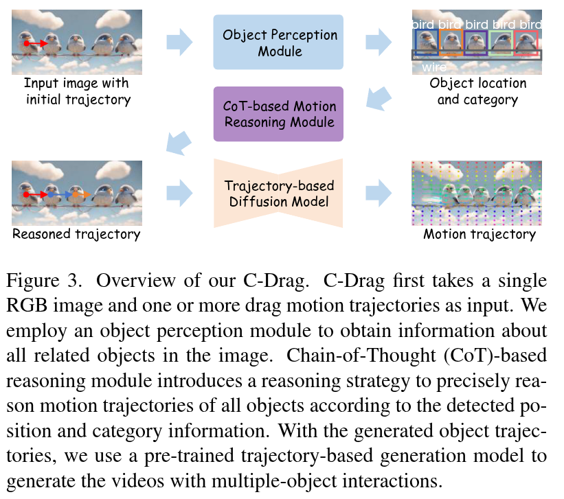

---

### PoseTraj: Pose-Aware Trajectory Control in Video Diffusion
 
 

 
\
2025-03-20\
**Authors:** Longbin Ji, Lei Zhong, Pengfei Wei, Changjian Li

Abstract

Recent advancements in trajectory-guided video generation have achieved notable progress. However, existing models still face challenges in generating object motions with potentially changing 6D poses under wide-range rotations, due to limited 3D understanding. To address this problem, we introduce PoseTraj, a pose-aware video dragging model for generating 3D-aligned motion from 2D trajectories. Our method adopts a novel two-stage pose-aware pretraining framework, improving 3D understanding across diverse trajectories. Specifically, we propose a large-scale synthetic dataset PoseTraj-10K, containing 10k videos of objects following rotational trajectories, and enhance the model perception of object pose changes by incorporating 3D bounding boxes as intermediate supervision signals. Following this, we fine-tune the trajectory-controlling module on real-world videos, applying an additional camera-disentanglement module to further refine motion accuracy. Experiments on various benchmark datasets demonstrate that our method not only excels in 3D pose-aligned dragging for rotational trajectories but also outperforms existing baselines in trajectory accuracy and video quality.

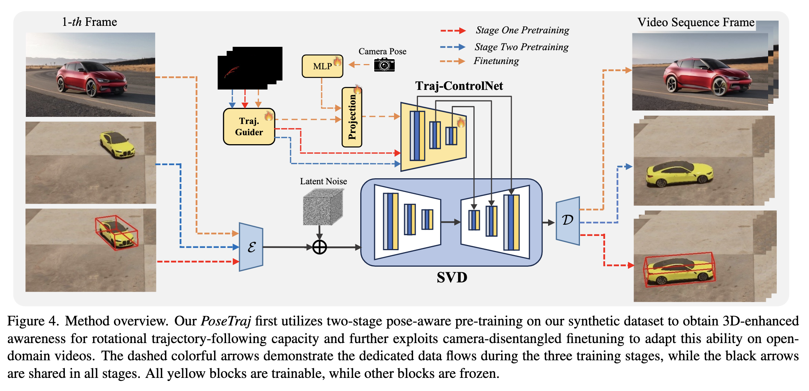

---

## 3D Drag Editing for 2D Image
### Diffusion Handles: Enabling 3D Edits for Diffusion Models by Lifting Activations to 3D
 
 

 
\
2023-12-02\
**Authors:** Karran Pandey, Paul Guerrero, Matheus Gadelha, Yannick Hold-Geoffroy, Karan Singh, Niloy Mitra

Abstract

Diffusion Handles is a novel approach to enabling 3D object edits on diffusion images. We accomplish these edits using existing pre-trained diffusion models, and 2D image depth estimation, without any fine-tuning or 3D object retrieval. The edited results remain plausible, photo-real, and preserve object identity. Diffusion Handles address a critically missing facet of generative image based creative design, and significantly advance the state-of-the-art in generative image editing. Our key insight is to lift diffusion activations for an object to 3D using a proxy depth, 3D-transform the depth and associated activations, and project them back to image space. The diffusion process applied to the manipulated activations with identity control, produces plausible edited images showing complex 3D occlusion and lighting effects. We evaluate Diffusion Handles: quantitatively, on a large synthetic data benchmark; and qualitatively by a user study, showing our output to be more plausible, and better than prior art at both, 3D editing and identity control. 

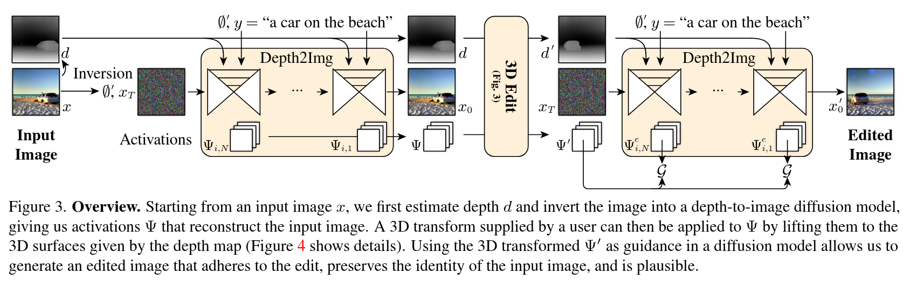

---

## 3D Drag Editing for 3D Object
### Drag3D: DragGAN meets GET3D

\
2023-05-23 \
[https://github.com/ashawkey/Drag3D](https://github.com/ashawkey/Drag3D)

Abstract

DragGAN meets GET3D for interactive mesh generation and editing.

---

### DragGaussian: Enabling Drag-style Manipulation on 3D Gaussian Representation
 
 
\
2025-05-09\
**Authors:** Sitian Shen, Jing Xu, Yuheng Yuan, Xingyi Yang, Qiuhong Shen, Xinchao Wang

Abstract

User-friendly 3D object editing is a challenging task that has attracted significant attention recently. The limitations of direct 3D object editing without 2D prior knowledge have prompted increased attention towards utilizing 2D generative models for 3D editing. While existing methods like Instruct NeRF-to-NeRF offer a solution, they often lack user-friendliness, particularly due to semantic guided editing. In the realm of 3D representation, 3D Gaussian Splatting emerges as a promising approach for its efficiency and natural explicit property, facilitating precise editing tasks. Building upon these insights, we propose DragGaussian, a 3D object drag-editing framework based on 3D Gaussian Splatting, leveraging diffusion models for interactive image editing with open-vocabulary input. This framework enables users to perform drag-based editing on pre-trained 3D Gaussian object models, producing modified 2D images through multi-view consistent editing. Our contributions include the introduction of a new task, the development of DragGaussian for interactive point-based 3D editing, and comprehensive validation of its effectiveness through qualitative and quantitative experiments.

---

### MvDrag3D: Drag-based Creative 3D Editing via Multi-view Generation-Reconstruction Priors
 

 
\
2024-10-21\
**Authors:** Honghua Chen, Yushi Lan, Yongwei Chen, Yifan Zhou, Xingang Pan

Abstract

Drag-based editing has become popular in 2D content creation, driven by the capabilities of image generative models. However, extending this technique to 3D remains a challenge. Existing 3D drag-based editing methods, whether employing explicit spatial transformations or relying on implicit latent optimization within limited-capacity 3D generative models, fall short in handling significant topology changes or generating new textures across diverse object categories. To overcome these limitations, we introduce MVDrag3D, a novel framework for more flexible and creative drag-based 3D editing that leverages multi-view generation and reconstruction priors. At the core of our approach is the usage of a multi-view diffusion model as a strong generative prior to perform consistent drag editing over multiple rendered views, which is followed by a reconstruction model that reconstructs 3D Gaussians of the edited object. While the initial 3D Gaussians may suffer from misalignment between different views, we address this via view-specific deformation networks that adjust the position of Gaussians to be well aligned. In addition, we propose a multi-view score function that distills generative priors from multiple views to further enhance the view consistency and visual quality. Extensive experiments demonstrate that MVDrag3D provides a precise, generative, and flexible solution for 3D drag-based editing, supporting more versatile editing effects across various object categories and 3D representations.

---

### DragScene: Interactive 3D Scene Editing with Single-view Drag Instructions
 
 
\
2024-12-18\
**Authors:** Chenghao Gu, Zhenzhe Li, Zhengqi Zhang, Yunpeng Bai, Shuzhao Xie, Zhi Wang

Abstract

3D editing has shown remarkable capability in editing scenes based on various instructions. However, existing methods struggle with achieving intuitive, localized editing, such as selectively making flowers blossom. Drag-style editing has shown exceptional capability to edit images with direct manipulation instead of ambiguous text commands. Nevertheless, extending drag-based editing to 3D scenes presents substantial challenges due to multi-view inconsistency. To this end, we introduce DragScene, a framework that integrates drag-style editing with diverse 3D representations. First, latent optimization is performed on a reference view to generate 2D edits based on user instructions. Subsequently, coarse 3D clues are reconstructed from the reference view using a point-based representation to capture the geometric details of the edits. The latent representation of the edited view is then mapped to these 3D clues, guiding the latent optimization of other views. This process ensures that edits are propagated seamlessly across multiple views, maintaining multi-view consistency. Finally, the target 3D scene is reconstructed from the edited multi-view images. Extensive experiments demonstrate that DragScene facilitates precise and flexible drag-style editing of 3D scenes, supporting broad applicability across diverse 3D representations.

---

### 3DGS-Drag: Dragging Gaussians for Intuitive Point-Based 3D Editing
 
) 

 
\
2025-01-23\
**Authors:** Jiahua Dong, Yu-Xiong Wang

Abstract

The transformative potential of 3D content creation has been progressively unlocked through advancements in generative models. Recently, intuitive drag editing with geometric changes has attracted significant attention in 2D editing yet remains challenging for 3D scenes. In this paper, we introduce 3DGS-Drag, a point-based 3D editing framework that provides efficient, intuitive drag manipulation of real 3D scenes. Our approach bridges the gap between deformation-based and 2D-editing-based 3D editing methods, addressing their limitations to geometry-related content editing. We leverage two key innovations: deformation guidance utilizing 3D Gaussian Splatting for consistent geometric modifications and diffusion guidance for content correction and visual quality enhancement. A progressive editing strategy further supports aggressive 3D drag edits. Our method enables a wide range of edits, including motion change, shape adjustment, inpainting, and content extension. Experimental results demonstrate the effectiveness of 3DGS-Drag in various scenes, achieving state-of-the-art performance in geometry-related 3D content editing. Notably, the editing is efficient, taking 10 to 20 minutes on a single RTX 4090 GPU.

---

### Drag Your Gaussian: Effective Drag-Based Editing with Score Distillation for 3D Gaussian Splatting
 

 
\
2025-01-30\
**Authors:** Yansong Qu, Dian Chen, Xinyang Li, Xiaofan Li, Shengchuan Zhang, Liujuan Cao, Rongrong Ji

Abstract

Recent advancements in 3D scene editing have been propelled by the rapid development of generative models. Existing methods typically utilize generative models to perform text-guided editing on 3D representations, such as 3D Gaussian Splatting (3DGS). However, these methods are often limited to texture modifications and fail when addressing geometric changes, such as editing a character's head to turn around. Moreover, such methods lack accurate control over the spatial position of editing results, as language struggles to precisely describe the extent of edits. To overcome these limitations, we introduce DYG, an effective 3D drag-based editing method for 3D Gaussian Splatting. It enables users to conveniently specify the desired editing region and the desired dragging direction through the input of 3D masks and pairs of control points, thereby enabling precise control over the extent of editing. DYG integrates the strengths of the implicit triplane representation to establish the geometric scaffold of the editing results, effectively overcoming suboptimal editing outcomes caused by the sparsity of 3DGS in the desired editing regions. Additionally, we incorporate a drag-based Latent Diffusion Model into our method through the proposed Drag-SDS loss function, enabling flexible, multi-view consistent, and fine-grained editing. Extensive experiments demonstrate that DYG conducts effective drag-based editing guided by control point prompts, surpassing other baselines in terms of editing effect and quality, both qualitatively and quantitatively.

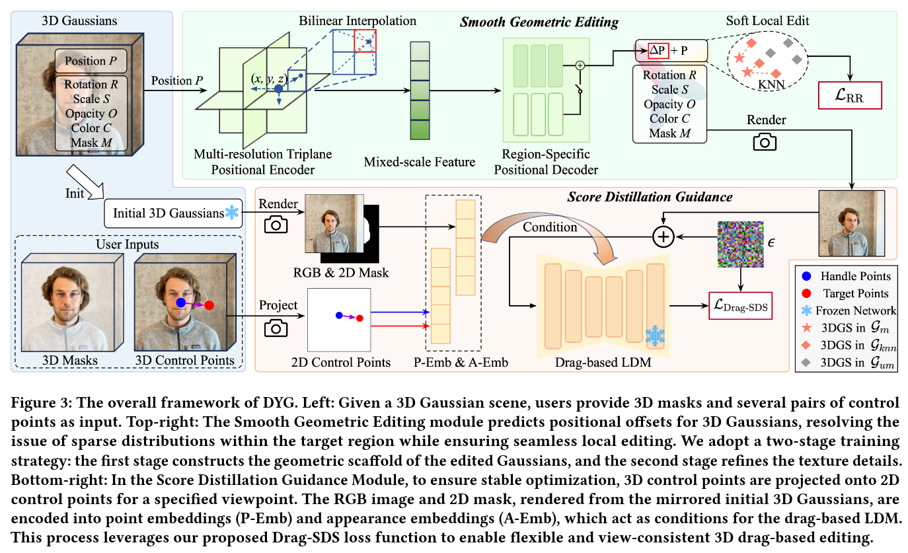

---

### Dragen3D: Multiview Geometry Consistent 3D Gaussian Generation with Drag-Based Control
 
 
\
2025-02-23\
**Authors:** Jinbo Yan, Alan Zhao, Yixin Hu

Abstract

Single-image 3D generation has emerged as a prominent research topic, playing a vital role in virtual reality, 3D modeling, and digital content creation. However, existing methods face challenges such as a lack of multi-view geometric consistency and limited controllability during the generation process, which significantly restrict their usability. % To tackle these challenges, we introduce Dragen3D, a novel approach that achieves geometrically consistent and controllable 3D generation leveraging 3D Gaussian Splatting (3DGS). We introduce the Anchor-Gaussian Variational Autoencoder (Anchor-GS VAE), which encodes a point cloud and a single image into anchor latents and decode these latents into 3DGS, enabling efficient latent-space generation. To enable multi-view geometry consistent and controllable generation, we propose a Seed-Point-Driven strategy: first generate sparse seed points as a coarse geometry representation, then map them to anchor latents via the Seed-Anchor Mapping Module. Geometric consistency is ensured by the easily learned sparse seed points, and users can intuitively drag the seed points to deform the final 3DGS geometry, with changes propagated through the anchor latents. To the best of our knowledge, we are the first to achieve geometrically controllable 3D Gaussian generation and editing without relying on 2D diffusion priors, delivering comparable 3D generation quality to state-of-the-art methods.

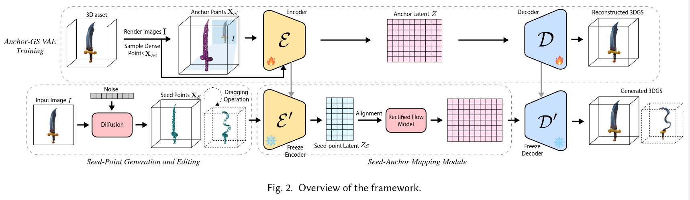

---

### ARAP-GS: Drag-driven As-Rigid-As-Possible 3D Gaussian Splatting Editing with Diffusion Prior
 
 
\
2025-04-17\
**Authors:** Xiao Han, Runze Tian, Yifei Tong, Fenggen Yu, Dingyao Liu, Yan Zhang

Abstract

Drag-driven editing has become popular among designers for its ability to modify complex geometric structures through simple and intuitive manipulation, allowing users to adjust and reshape content with minimal technical skill. This drag operation has been incorporated into numerous methods to facilitate the editing of 2D images and 3D meshes in design. However, few studies have explored drag-driven editing for the widely-used 3D Gaussian Splatting (3DGS) representation, as deforming 3DGS while preserving shape coherence and visual continuity remains challenging. In this paper, we introduce ARAP-GS, a drag-driven 3DGS editing framework based on As-Rigid-As-Possible (ARAP) deformation. Unlike previous 3DGS editing methods, we are the first to apply ARAP deformation directly to 3D Gaussians, enabling flexible, drag-driven geometric transformations. To preserve scene appearance after deformation, we incorporate an advanced diffusion prior for image super-resolution within our iterative optimization process. This approach enhances visual quality while maintaining multi-view consistency in the edited results. Experiments show that ARAP-GS outperforms current methods across diverse 3D scenes, demonstrating its effectiveness and superiority for drag-driven 3DGS editing. Additionally, our method is highly efficient, requiring only 10 to 20 minutes to edit a scene on a single RTX 3090 GPU.

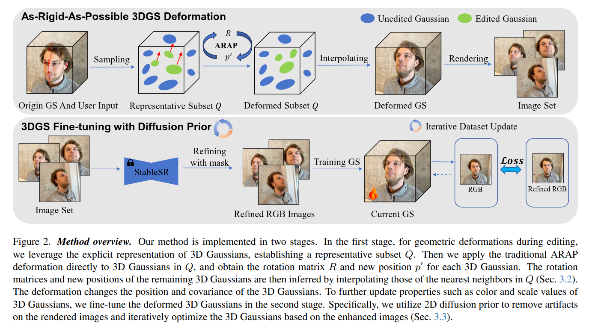

---

## 4D Drag Editing
### PartRM: Modeling Part-Level Dynamics with Large Cross-State Reconstruction Model
 
 

 
\
2025-03-25\
**Authors:** Mingju Gao, Yike Pan, Huan-ang Gao, Zongzheng Zhang, Wenyi Li, Hao Dong, Hao Tang, Li Yi, Hao Zhao

Abstract

As interest grows in world models that predict future states from current observations and actions, accurately modeling part-level dynamics has become increasingly relevant for various applications. Existing approaches, such as Puppet-Master, rely on fine-tuning large-scale pre-trained video diffusion models, which are impractical for real-world use due to the limitations of 2D video representation and slow processing times. To overcome these challenges, we present PartRM, a novel 4D reconstruction framework that simultaneously models appearance, geometry, and part-level motion from multi-view images of a static object. PartRM builds upon large 3D Gaussian reconstruction models, leveraging their extensive knowledge of appearance and geometry in static objects. To address data scarcity in 4D, we introduce the PartDrag-4D dataset, providing multi-view observations of part-level dynamics across over 20,000 states. We enhance the model's understanding of interaction conditions with a multi-scale drag embedding module that captures dynamics at varying granularities. To prevent catastrophic forgetting during fine-tuning, we implement a two-stage training process that focuses sequentially on motion and appearance learning. Experimental results show that PartRM establishes a new state-of-the-art in part-level motion learning and can be applied in manipulation tasks in robotics. Our code, data, and models are publicly available to facilitate future research.

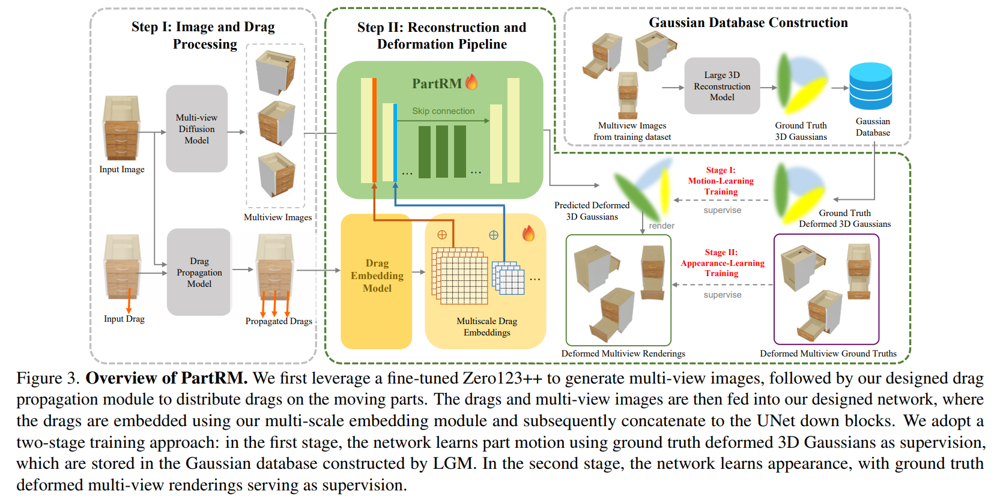

---

## Uncategory Papers

### Diffusion Self-Guidance for Controllable Image Generation
 
 

 
\
2023-06-01\
**Authors:** Dave Epstein, Allan Jabri, Ben Poole, Alexei A. Efros, Aleksander Holynski

Abstract

Large-scale generative models are capable of producing high-quality images from detailed text descriptions. However, many aspects of an image are difficult or impossible to convey through text. We introduce self-guidance, a method that provides greater control over generated images by guiding the internal representations of diffusion models. We demonstrate that properties such as the shape, location, and appearance of objects can be extracted from these representations and used to steer sampling. Self-guidance works similarly to classifier guidance, but uses signals present in the pretrained model itself, requiring no additional models or training. We show how a simple set of properties can be composed to perform challenging image manipulations, such as modifying the position or size of objects, merging the appearance of objects in one image with the layout of another, composing objects from many images into one, and more. We also show that self-guidance can be used to edit real images. 

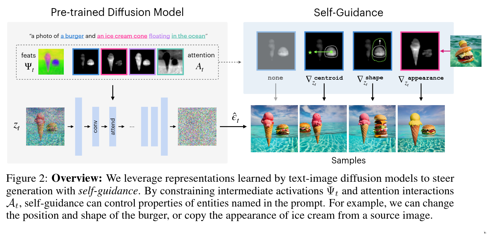

---

### Masked-Attention Diffusion Guidance for Spatially Controlling Text-to-Image Generation
 
 

 
\
2023-08-11\
**Authors:** Yuki Endo

Abstract

Text-to-image synthesis has achieved high-quality results with recent advances in diffusion models. However, text input alone has high spatial ambiguity and limited user controllability. Most existing methods allow spatial control through additional visual guidance (e.g., sketches and semantic masks) but require additional training with annotated images. In this paper, we propose a method for spatially controlling text-to-image generation without further training of diffusion models. Our method is based on the insight that the cross-attention maps reflect the positional relationship between words and pixels. Our aim is to control the attention maps according to given semantic masks and text prompts. To this end, we first explore a simple approach of directly swapping the cross-attention maps with constant maps computed from the semantic regions. Some prior works also allow training-free spatial control of text-to-image diffusion models by directly manipulating cross-attention maps. However, these approaches still suffer from misalignment to given masks because manipulated attention maps are far from actual ones learned by diffusion models. To address this issue, we propose masked-attention guidance, which can generate images more faithful to semantic masks via indirect control of attention to each word and pixel by manipulating noise images fed to diffusion models. Masked-attention guidance can be easily integrated into pre-trained off-the-shelf diffusion models (e.g., Stable Diffusion) and applied to the tasks of text-guided image editing. Experiments show that our method enables more accurate spatial control than baselines qualitatively and quantitatively.

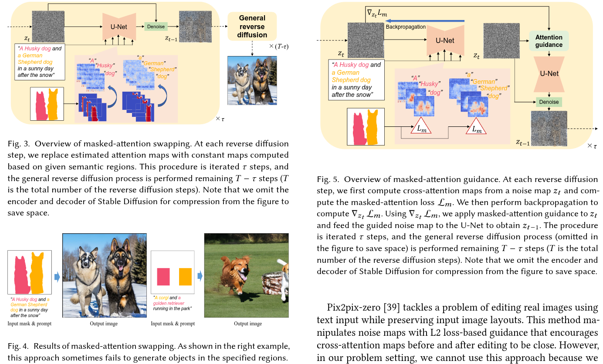

---

### Motion Guidance: Diffusion-Based Image Editing with Differentiable Motion Estimators
 
 

 
\
2024-01-31\
**Authors:** Daniel Geng, Andrew Owens

Abstract

Diffusion models are capable of generating impressive images conditioned on text descriptions, and extensions of these models allow users to edit images at a relatively coarse scale. However, the ability to precisely edit the layout, position, pose, and shape of objects in images with diffusion models is still difficult. To this end, we propose motion guidance, a zero-shot technique that allows a user to specify dense, complex motion fields that indicate where each pixel in an image should move. Motion guidance works by steering the diffusion sampling process with the gradients through an off-the-shelf optical flow network. Specifically, we design a guidance loss that encourages the sample to have the desired motion, as estimated by a flow network, while also being visually similar to the source image. By simultaneously sampling from a diffusion model and guiding the sample to have low guidance loss, we can obtain a motion-edited image. We demonstrate that our technique works on complex motions and produces high quality edits of real and generated images.

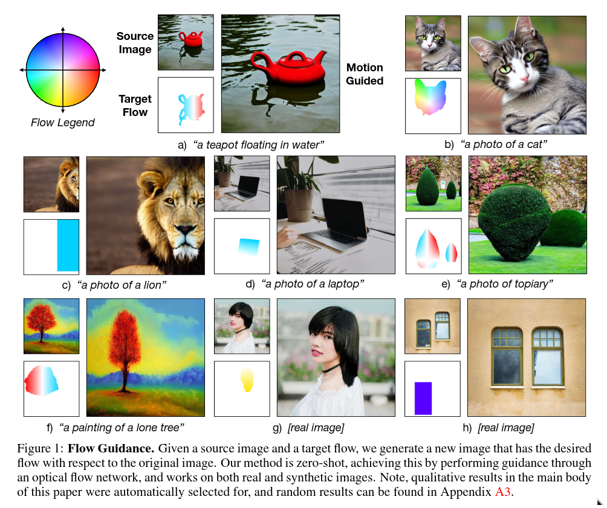

---

### GeoDiffuser: Geometry-Based Image Editing with Diffusion Models
 
 

 
\
2024-04-22\
**Authors:** Rahul Sajnani, Jeroen Vanbaar, Jie Min, Kapil Katyal, Srinath Sridhar

Abstract

The success of image generative models has enabled us to build methods that can edit images based on text or other user input. However, these methods are bespoke, imprecise, require additional information, or are limited to only 2D image edits. We present GeoDiffuser, a zero-shot optimization-based method that unifies common 2D and 3D image-based object editing capabilities into a single method. Our key insight is to view image editing operations as geometric transformations. We show that these transformations can be directly incorporated into the attention layers in diffusion models to implicitly perform editing operations. Our training-free optimization method uses an objective function that seeks to preserve object style but generate plausible images, for instance with accurate lighting and shadows. It also inpaints disoccluded parts of the image where the object was originally located. Given a natural image and user input, we segment the foreground object using SAM and estimate a corresponding transform which is used by our optimization approach for editing. GeoDiffuser can perform common 2D and 3D edits like object translation, 3D rotation, and removal. We present quantitative results, including a perceptual study, that shows how our approach is better than existing methods.

---

### Move Anything with Layered Scene Diffusion
 

 
\
2024-04-10\
**Authors:** Jiawei Ren, Mengmeng Xu, Jui-Chieh Wu, Ziwei Liu, Tao Xiang, Antoine Toisoul

Abstract

Diffusion models generate images with an unprecedented level of quality, but how can we freely rearrange image layouts? Recent works generate controllable scenes via learning spatially disentangled latent codes, but these methods do not apply to diffusion models due to their fixed forward process. In this work, we propose SceneDiffusion to optimize a layered scene representation during the diffusion sampling process. Our key insight is that spatial disentanglement can be obtained by jointly denoising scene renderings at different spatial layouts. Our generated scenes support a wide range of spatial editing operations, including moving, resizing, cloning, and layer-wise appearance editing operations, including object restyling and replacing. Moreover, a scene can be generated conditioned on a reference image, thus enabling object moving for in-the-wild images. Notably, this approach is training-free, compatible with general text-to-image diffusion models, and responsive in less than a second.

---

### ParamsDrag: Interactive Parameter Space Exploration via Image-Space Dragging
 
 

 
\
2024-07-19\
**Authors:** Guan Li, Yang Liu, Guihua Shan, Shiyu Cheng, Weiqun Cao, Junpeng Wang, Ko-Chih Wang

Abstract

Numerical simulation serves as a cornerstone in scientific modeling, yet the process of fine-tuning simulation parameters poses significant challenges. Conventionally, parameter adjustment relies on extensive numerical simulations, data analysis, and expert insights, resulting in substantial computational costs and low efficiency. The emergence of deep learning in recent years has provided promising avenues for more efficient exploration of parameter spaces. However, existing approaches often lack intuitive methods for precise parameter adjustment and optimization. To tackle these challenges, we introduce ParamsDrag, a model that facilitates parameter space exploration through direct interaction with visualizations. Inspired by DragGAN, our ParamsDrag model operates in three steps. First, the generative component of ParamsDrag generates visualizations based on the input simulation parameters. Second, by directly dragging structure-related features in the visualizations, users can intuitively understand the controlling effect of different parameters. Third, with the understanding from the earlier step, users can steer ParamsDrag to produce dynamic visual outcomes. Through experiments conducted on real-world simulations and comparisons with state-of-the-art deep learning-based approaches, we demonstrate the efficacy of our solution.

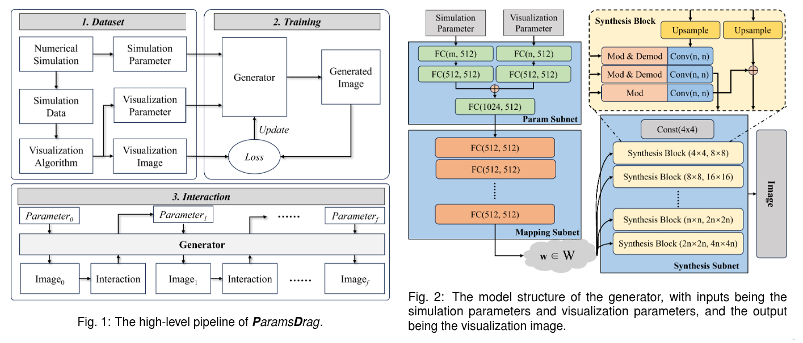

---

### Motion Prompting: Controlling Video Generation with Motion Trajectories
 
 

 
\
2024-12-03\
**Authors:** Daniel Geng, Charles Herrmann, Junhwa Hur, Forrester Cole, Serena Zhang, Tobias Pfaff, Tatiana Lopez-Guevara, Carl Doersch, Yusuf Aytar, Michael Rubinstein, Chen Sun, Oliver Wang, Andrew Owens, Deqing Sun

Abstract

Motion control is crucial for generating expressive and compelling video content; however, most existing video generation models rely mainly on text prompts for control, which struggle to capture the nuances of dynamic actions and temporal compositions. To this end, we train a video generation model conditioned on spatio-temporally sparse or dense motion trajectories. In contrast to prior motion conditioning work, this flexible representation can encode any number of trajectories, object-specific or global scene motion, and temporally sparse motion; due to its flexibility we refer to this conditioning as motion prompts. While users may directly specify sparse trajectories, we also show how to translate high-level user requests into detailed, semi-dense motion prompts, a process we term motion prompt expansion. We demonstrate the versatility of our approach through various applications, including camera and object motion control, "interacting" with an image, motion transfer, and image editing. Our results showcase emergent behaviors, such as realistic physics, suggesting the potential of motion prompts for probing video models and interacting with future generative world models. Finally, we evaluate quantitatively, conduct a human study, and demonstrate strong performance. 

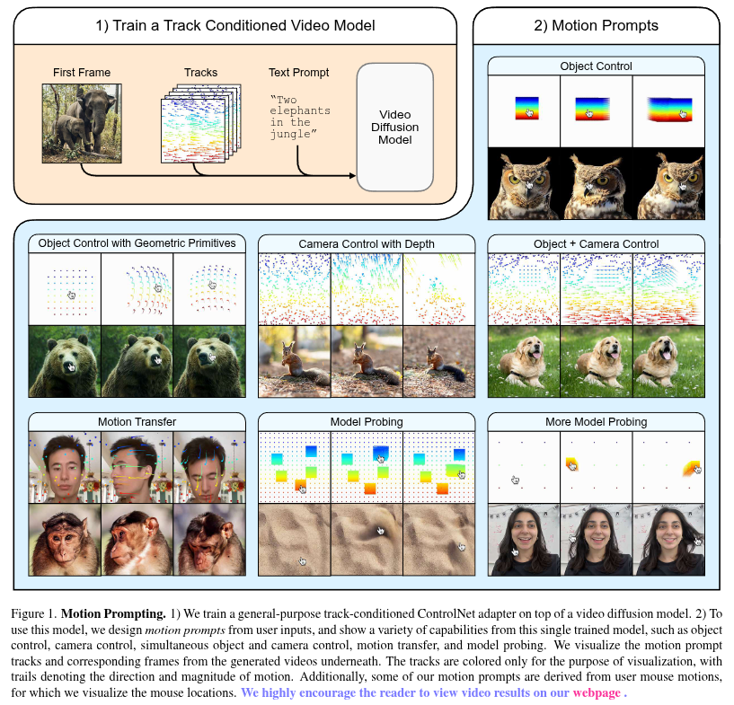

---

### DreamOmni: Unified Image Generation and Editing
 
 
\
2024-12-22\
**Authors:** Bin Xia, Yuechen Zhang, Jingyao Li, Chengyao Wang, Yitong Wang, Xinglong Wu, Bei Yu, Jiaya Jia

Abstract

Currently, the success of large language models (LLMs) illustrates that a unified multitasking approach can significantly enhance model usability, streamline deployment, and foster synergistic benefits across different tasks. However, in computer vision, while text-to-image (T2I) models have significantly improved generation quality through scaling up, their framework design did not initially consider how to unify with downstream tasks, such as various types of editing. To address this, we introduce DreamOmni, a unified model for image generation and editing. We begin by analyzing existing frameworks and the requirements of downstream tasks, proposing a unified framework that integrates both T2I models and various editing tasks. Furthermore, another key challenge is the efficient creation of high-quality editing data, particularly for instruction-based and drag-based editing. To this end, we develop a synthetic data pipeline using sticker-like elements to synthesize accurate, high-quality datasets efficiently, which enables editing data scaling up for unified model training. For training, DreamOmni jointly trains T2I generation and downstream tasks. T2I training enhances the model's understanding of specific concepts and improves generation quality, while editing training helps the model grasp the nuances of the editing task. This collaboration significantly boosts editing performance. Extensive experiments confirm the effectiveness of DreamOmni.

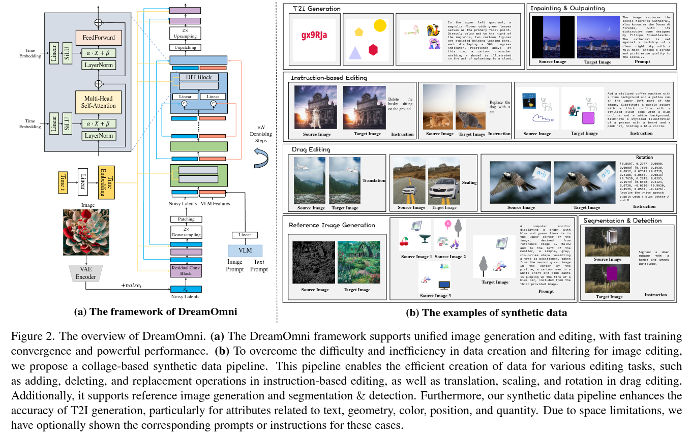

---

## Datasets
### DragBench
https://github.com/Yujun-Shi/DragDiffusion/releases/tag/v0.1.1
### FreeDragBench
https://drive.google.com/file/d/1p2muR6aW6fqEGW8yTcHl86DCuUkwgtNY/view?usp=sharing
### Drag100
https://drive.google.com/file/d/1qzUizzrSRd4bBaT-0bCYZr-MDpiKXjhW/view?usp=sharing
## Software & Tools
comming soon...
## Tutorials & Videos
comming soon...
## Related Repositories
* [Awesome-DragGAN](https://github.com/OpenGVLab/Awesome-DragGAN)
* [Awesome Diffusion Categorized](https://github.com/wangkai930418/awesome-diffusion-categorized?tab=readme-ov-file#drag-edit)
* [Awesome-Image-Editing](https://github.com/xinchengshuai/Awesome-Image-Editing)
* [training-free-methods](https://github.com/littlewhitesea/training-free-methods)

## Contact Info
[contact@frakw.com](mailto:contact@frakw.com)